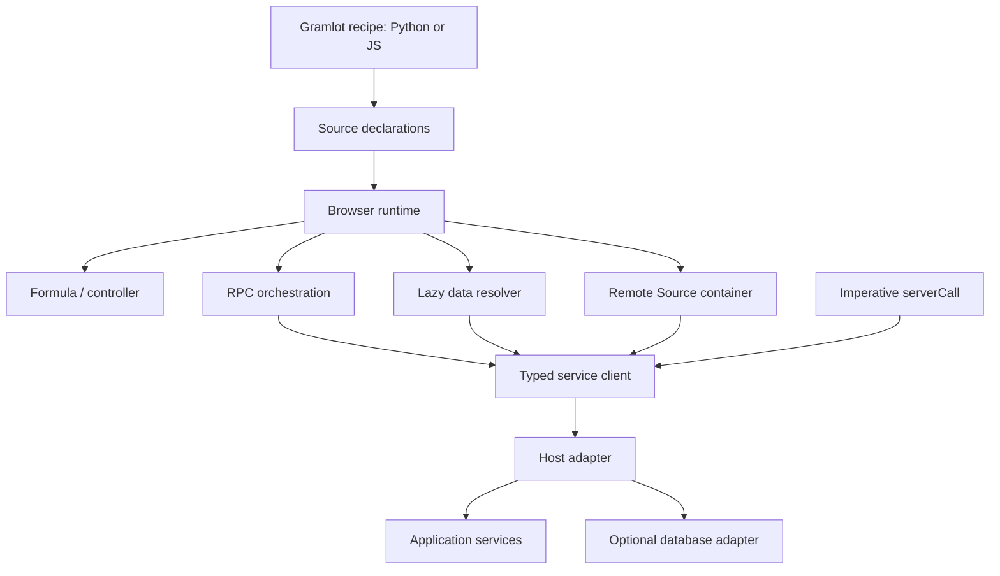

# Legacy data providers and remote services: input to GramlotBuilder

Date: 2026-09-09. Status: source inventory and design recommendations, not a porting commitment. Sources were inspected in `/Users/gporcari/Sviluppo/Genropy/genropy`; file/line references below describe that checkout and are not immutable revision pins.

## Distinguish the operations

| Legacy API | What it represents | Result destination | Gramlot implication |
| --- | --- | --- | --- |
| dataFormula | Client expression evaluated from inputs | Data path | Browser declaration owned by Gramlot |
| dataController | Client script with side effects and triggers | Explicit script writes | Browser declaration owned by Gramlot |
| dataRpc | Declarative service call, with parameter bindings and lifecycle hooks | Optional Data path plus callbacks | General service orchestration, independent of a database |
| dataRemote | Remote resolver installed on a Data node, with caching/loading behavior | Data node resolver/value | Lazy data is a different contract from triggered RPC |
| dataRecord | Convenience around dataRpc, default app.getRecord | Record data | Optional database/domain adapter |
| dataSelection | Convenience around dataRpc, default app.getSelection | Selection data | Optional database/domain adapter, with query/paging contracts |
| remote | Configure a container whose Source content is built remotely | Source children of a container | Remote UI composition, not just fetching Data |
| genro.serverCall | Imperative call from JavaScript | Return/callback, no automatic destination binding | Low-level service API shared by declarative wrappers |

The diagram is a proposed Gramlot separation informed by legacy, not the current module implementation.

## Declarative RPC

Python `gnrpy/gnr/web/gnrwebstruct/dojo11.py:112` implements `dataRpc(pathOrMethod, method=None, **kwargs)`. With a callable first argument and no separate method, the implementation permits no destination path; this is more precise than the older docstring's mandatory-path wording. Callback/errback child nodes support chained processing.

In `gnrjs/gnr_d11/js/gnrdomsource.js`, `setDataNodeValueDo` resolves the destination and current bound parameters. The dataRpc branch (around line 390) supports `_onCalling`, `_onResult`, `_onError`; a false `_onCalling` cancels the call. Success writes the result to the destination when present, then invokes result handling. Deferred tracking and callback chains provide additional lifecycle behavior. The default HTTP method is POST, with legacy switches including `_POST=False`.

Bindings distinguish subscribed values (`^`) from values read when execution occurs (`=`); do not assume every legacy provider has identical startup and timing behavior. `genro_src.js` around lines 615–675 handles provider installation, initial/start/built hooks, timing and subscriptions.

For Gramlot, explicitly define pending/error state, result typing, latest-result policy, cancellation and disposal. A callback returning after a component is removed must have a defined outcome. Decide which hooks are needed initially rather than carrying every legacy switch forward.

## Lazy remote data

`dojo11.py:424` emits dataRemote and can resolve an initial value on the Python side when `_resolved` is requested. The browser dataRemote branch in `gnrdomsource.js` around line 487 creates a remote resolver and installs it as a Data-node value. `genro_rpc.js` contains GnrRemoteResolver and remoteResolver (around line 694): cache lifetime and lazy access are central to this mechanism. An initially resolved value can seed the resolver. `dataResource` at `dojo11.py:449` specializes dataRemote for resource content.

This differs from “call now and assign the returned value.” Gramlot must decide whether lazy access is expressed through an async resolver API, explicit load, or another observable resource abstraction. Legacy synchronous resolver defaults must not be copied as an accidental browser contract.

## Database conveniences

`dojo11.py:348` implements dataSelection by emitting dataRpc, normally calling `app.getSelection`, with table, columns, where, ordering, grouping and related arguments. `dojo11.py:410` implements dataRecord the same way, normally calling `app.getRecord` with table/pkey arguments.

These are not independent transport primitives. Preserve the possibility of concise record/selection helpers in an optional integration package without requiring Genropy database semantics in Gramlot core. Selection identity, paging, query ownership, permissions and form persistence are additional domain contracts, not solved merely by keeping these method names.

## Remote Source construction

`gnrpy/gnr/web/gnrwebstruct/base.py:847` implements `remote(method=None, lazy=True, cachedRemote=None, **kwargs)`. It configures an existing container with the remoteBuilder handler and remote arguments. With lazy disabled, the server handler can build initial children immediately; later remote construction still concerns Source content.

Consequently, a proposed Gramlot `remote` element is not automatically equivalent to legacy `pane.remote(...)`. Settle the receiver, destination, argument binding, replacement versus append, disposal, datapath and callback scope explicitly. Python authoring browser declarations does not mean Python can never execute: a remote fragment service may legitimately run Python to produce Source.

## Imperative calls and transport

`gnrjs/gnr_d11/js/genro.js:2199` implements `genro.serverCall(method, params, async_cb, mode, httpMethod)` as a wrapper over RPC remoteCall, normally using POST. It does not create a reactive destination declaration.

`genro_rpc.js:450` implements remoteCall, including typed Bag responses, XHR and a WSK branch. Its legacy no-callback path forces synchronous execution; that is historical behavior, not a recommendation. Gramlot should choose an explicit asynchronous return/error contract and let callbacks be an optional convenience. HTTP and WebSocket transports should carry the same service-level result semantics where supported, without promising that all transport capabilities are interchangeable.

## Proposed implementation boundaries

1. A typed service client: method/resource identity, parameters, result, errors, cancellation and host capabilities.
2. Declarative runtime adapters: RPC execution, lazy loading and remote Source construction, each with its own lifecycle.
3. Optional domain helpers: record/selection and future store/form adapters.

The host adapter may target Genro ASGI, FastAPI or another server. It must resolve authorized application services and resources; method names in a declaration must not automatically expose arbitrary Python attributes. Authentication and page/connection context come from the host contract. Do not assume cached mutable page instances or full Data mirroring.

## Decisions still open

- Exact public names/signatures, positional mapping and Python/JS parity.
- Which service primitive belongs in the first usable release.
- Parameter snapshots versus live reads; trigger and initialization semantics.
- Loading/error representation, caching scope, invalidation and stale responses.
- Remote fragment insertion, builder ownership, disposal and isolation of methods/IDs.
- Typed Source/Data transport identity and adapter capability discovery.

Read alongside [GramlotBuilder draft](gramlot-builder.md), [feasibility evidence](gramlot-builder-verification.md) and [open work](open-work.md). No legacy service runtime was copied as part of this inventory.
