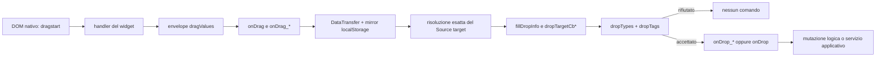

# Genropy legacy: manuale del drag & drop logico

Data della ricostruzione: 12 settembre 2026\
Revisione legacy esaminata: `418b4454a6e08445817e858a1b5d2a2c91c2dbf5`
(`feat/dojo-xhr-patch`, commit del 9 settembre 2026)\
Repository legacy: `/Users/gporcari/Sviluppo/Genropy/genropy`

## Scopo, stato e attendibilità

Questo è un manuale d'uso ricostruito dal codice di Genropy legacy. Descrive il
drag & drop come **comando logico**: una sorgente offre uno o più dati tipizzati,
un bersaglio decide se accettarli e il callback di drop esegue l'operazione
applicativa, per esempio assegnare, copiare, spostare una risorsa, riordinare
righe o colonne, oppure chiamare un servizio.

Il trasporto HTML5 non modifica da solo né Source, né Data, né store. La scritta
`move` mostrata dal browser non prova che qualcosa sia stato spostato. La
mutazione avviene soltanto nel consumer o negli hook specifici della grid.
`selfDragRows`, in particolare, riordina logicamente i nodi dello store; non
sposta fisicamente un widget sullo schermo.

Il documento non propone un'API Gramlot e non tratta il posizionamento libero
su canvas. `moveable`, resize e floating pane sono sistemi distinti; il confine
è riepilogato in [Movimento visuale: confine con un altro sistema](#movimento-visuale-confine-con-un-altro-sistema).

Le indicazioni sono classificate così:

- **verificato nel codice**: comportamento letto nell'implementazione della
  revisione indicata;
- **uso storico**: dichiarazione trovata in una pagina o in un componente
  legacy, utile per capire l'intenzione ma non equivalente a un test;
- **derivato**: esempio ridotto mantenendo il contratto osservato, non eseguito;
- **irrisolto**: il codice suggerisce un risultato che non è stato riprodotto
  in browser.

Le pagine storiche citate non sono state avviate. Non esiste, nelle ricerche
effettuate, una suite unitaria focalizzata sul dispatcher DnD centrale.

## Navigazione

1. [Modello mentale](#modello-mentale)
2. [Riferimento rapido degli attributi](#riferimento-rapido-degli-attributi)
3. [Sequenza completa](#sequenza-completa)
4. [Envelope, tipi e trasporto](#envelope-tipi-e-trasporto)
5. [Accettazione per tipo e tag](#accettazione-per-tipo-e-tag)
6. [Callback: firme, contesto e valori di ritorno](#callback-firme-contesto-e-valori-di-ritorno)
7. [Contenuto di `dragInfo` e `dropInfo`](#contenuto-di-draginfo-e-dropinfo)
8. [HTML generico, tree e grid](#html-generico-tree-e-grid)
9. [Scenari e ricette storiche](#scenari-e-ricette-storiche)
10. [Diagnosi pratica](#diagnosi-pratica)
11. [Mappa delle fonti](#mappa-delle-fonti)

## Modello mentale

Una dichiarazione completa ha quattro responsabilità separate:

| Responsabilità | Meccanismo legacy | Effetto |
| --- | --- | --- |
| Rendere trascinabile | `draggable`, oppure gli switch specifici della grid | Abilita l'avvio nativo di `dragstart` su un DOM node |
| Preparare l'offerta | handler del widget, `dragValue`, `onDrag`, `onDrag_*`, `dragTags` | Costruisce un oggetto con più rappresentazioni dello stesso comando |
| Instradare l'offerta | `dropTarget`, `dropTypes`, `dropTags`, `dropTargetCb*`, `dropTarget_*` della grid | Stabilisce se quel bersaglio e quella sua zona sono eleggibili |
| Eseguire il comando | `onDrop`, `onDrop_*`, hook self-drop o callback applicativo | Modifica Data/store/Source o chiama un servizio |



L'envelope può offrire contemporaneamente, per esempio, `text/plain`,
`text/html`, `gridrow` e `dbrecords`. Il target sceglie la rappresentazione che
conosce. I nomi custom non sono MIME registrati: il runtime accetta chiavi
arbitrarie e le tratta come tipi di trasporto.

## Riferimento rapido degli attributi

### Sorgente generica

| Attributo, case esatto | Valore e default osservato | Lookup / consumer | Contratto verificato |
| --- | --- | --- | --- |
| `draggable` | Booleano, valore truthy o puntatore Data; assente/falsy = non abilitato dal builder | Nodo corrente; builder generico e handler del widget | Legge `getAttributeFromDatasource('draggable')`; se truthy chiama `setDraggable`. Su HTML scrive l'attributo nativo `draggable`. Non è ereditato dal dispatcher. |
| `dragValue` | Qualunque valore risolvibile; nessun default | Solo nodo sorgente; handler HTML base | Prima scelta del payload `text/plain`. Usa `currentFromDatasource`, quindi supporta il normale valore/puntatore legacy. |
| `value` | Valore normale del widget | Solo nodo sorgente; fallback HTML | Seconda scelta per `text/plain`. |
| `innerHTML` | Stringa/valore risolvibile | Solo nodo sorgente; fallback HTML | Terza scelta; in assenza usa `dragInfo.domnode.innerHTML`. |
| `dragTags` | Stringa di tag separati da virgola; assente = nessun tag | Ereditato con `getInheritedAttributes()` | Viene unito a un eventuale `dragValues.dragTags`, poi scritto in `dragsourceinfo.dragTags`. Il campo locale viene rimosso dall'envelope. |
| `onDrag` | Stringa JavaScript o funzione | Ereditato | Riceve `dragValues, dragInfo, treeItem`; può mutare l'envelope. `return false` cancella soltanto se non esiste alcun `onDrag_*`. |
| `onDrag_*` | Stringa JavaScript o funzione; `*` è solo un nome applicativo | Tutti gli attributi ereditati con quel prefisso | Sono eseguiti tutti, nell'ordine di enumerazione dell'oggetto. Il suffisso non crea un tipo e il ritorno viene ignorato: il codice deve scrivere esplicitamente in `dragValues`. |
| `dragClass` | Nome CSS; default `draggedItem`; falsy disabilita | Ereditato | Applicato per circa 1 ms al DOM sorgente per influenzare l'immagine nativa. Non è usato se il widget fornisce `dragInfo.dragImageNode`. |
| `detachable` | Truthy/falsy; default assente | Nodo corrente per l'abilitazione, metadato nell'envelope | Abilita un percorso speciale solo con Shift. È una rilocazione di DOM in FloatingPane, non il normale DnD logico. |
| `dragmode` | Stringa sull'elemento DOM; normalmente prodotta/ridefinita dall'handler | DOM risolto, poi `fillDragInfo` | Copiata in `dragInfo` e `dragsourceinfo`; per la grid assume `row`, `cell` o `column`. |

Il generico Python `GnrDomSrc.child(..., **kwargs)` conserva attributi arbitrari
nella Source Bag; non esiste una firma Python chiusa per il DnD. La prova del
supporto è quindi il consumer JavaScript, non il fatto che una kwarg sia
accettata (`gnrpy/gnr/web/gnrwebstruct/base.py:209-267`).

### Target generico

| Attributo, case esatto | Valore e default osservato | Lookup / consumer | Contratto verificato |
| --- | --- | --- | --- |
| `dropTarget` | Truthy/falsy; default assente | Proprietà del Source node esatto | Il builder salva il valore e chiama `setDropTarget`; abilita la candidatura del nodo, non l'accettazione di alcun tipo. Non è cercato sugli antenati durante la risoluzione del target. |
| `dropTypes` | Stringa separata da virgole; nessun default nel filtro, `text/plain` solo nel dispatcher | Ereditato | Elenco dei tipi accettabili. Il filtro usa `splitStrip`; il dispatcher usa `.split(',')` senza trim. Le wildcard sono regex permissive, non glob esatti. |
| `dropTags` | Espressione stringa; assente = nessun vincolo tag | Ereditato | Virgola = OR; separatore letterale ` AND ` = AND; `!tag` = assenza richiesta. Case-sensitive. |
| `onDrop` | Stringa JavaScript o funzione | Ereditato | Callback aggregato. Per drop standard riceve soltanto i tipi accettati che non hanno un `onDrop_<tipo>`; per file riceve `files`. |
| `onDrop_*` | Stringa JavaScript o funzione; suffisso normalizzato per il dispatch | Ereditato | Callback per singolo tipo offerto. Il nome reale è `onDrop_` più il tipo con ogni carattere non-word sostituito da `_`: `text/plain` → `onDrop_text_plain`. |
| `dropTargetCb` | Stringa JavaScript o funzione | Memorizzato sul Source node esatto | Guard dinamica prima dell'accettazione. Deve restituire truthy; un ritorno falsy, anche `undefined`, invalida il target. Rieseguito al drop effettivo. |
| `dropTargetCb_*` | Stringa JavaScript o funzione; suffisso usato come tipo esatto | Memorizzato sul Source node esatto | Tutti i guard configurati sono chiamati come `(dropInfo, data)`, anche se il tipo non è offerto; in tal caso `data` tende a `null`. Il primo ritorno falsy interrompe e invalida. Il suffisso non viene aggiunto a `dropTypes`. |
| `drop_ext` | Estensioni separate da virgola, senza punto; assente = tutte | Ereditato; solo percorso `Files` | Confronto case-insensitive sull'ultima parte di `file.name.split('.')`. Non controlla MIME, contenuto, dimensione o firma. |
| `dragOverCb` | Funzione JavaScript già callable | Ereditato dal Source node direttamente presente su `event.target` | Chiamata durante `dragover` come `(event)` con `this === genro.dom`. Il builder non compila una stringa Python per questo attributo nel percorso osservato. |

Un target dichiarato soltanto con `dropTarget=True` e `onDrop=...` non ha tipi
nel filtro e viene normalmente rifiutato prima che il default `text/plain` del
dispatcher possa servire. Dichiarare sempre il tipo effettivo, o un
`onDrop_<tipo>` custom che il filtro riesca davvero a correlare.

### Grid

| Attributo, case esatto | Valore / default | Effetto verificato |
| --- | --- | --- |
| `draggable_row` | Truthy/falsy; default assente | Rende trascinabili le tabelle di riga. Su mobile il setter desktop ritorna subito e viene creato un `drag_handle` dedicato se la struttura viene rigenerata. |
| `draggable_column` | Truthy/falsy; default assente | Rende draggable il contenuto dell'header di colonna. |
| `draggable` sulla cella di struct | Truthy/falsy | Rende draggable il `div.cellContent` di quella cella. |
| `dropTarget_grid` | Lista tipi | Accetta sulla superficie della grid. Non viene scelta per un self-drop della stessa grid. |
| `dropTarget_column` | Lista tipi | Accetta su una colonna/header. |
| `dropTarget_row` | Lista tipi | Accetta su una riga e aggiunge `targetRowData`. |
| `dropTarget_cell` | Lista tipi | Accetta sulla singola cella. |
| `selfDragRows` | `True`, stringa/funzione `(info)` o falsy; default assente | Prepara tipo privato `selfdragrow_<sourceNode._id>` con gli indici selezionati e installa il riordino logico sullo stesso store. La funzione è valutata sia alla partenza sia sul target. |
| `selfDragColumns` | `True`, stringa/funzione `(info)`, `'trashable'`, o falsy | Prepara `selfdragcolumn_<sourceNode._id>` con l'indice colonna e installa lo spostamento della cella di struct. Con `configurable=True`, se non è esplicitamente `False`, viene predisposto automaticamente. |
| `onSelfDropRows` | Stringa/funzione `(rows, dropInfo)` | Sostituisce completamente il `moveRow` predefinito. `rows` sono indici, non record. Il ritorno è ignorato. |
| `afterSelfDropRows` | Stringa/funzione | Eseguito dopo il riordino/hook. Il runtime passa effettivamente `(rows, dropInfo, row_counter_changes)`, benché la forma stringa sia compilata dichiarando solo `rows,dropInfo`; `$3` o una funzione completa possono leggere il terzo argomento. |
| `onTrashed` | Stringa/funzione `(dropInfo, data)` | Usato dal configuratore per una colonna `trashable`; default `this.widget.deleteColumn(data);`. |

`dropModes` **non è un attributo pubblico osservato**. È l'oggetto interno
`sourceNode.dropModes`, costruito estraendo gli attributi `dropTarget_*`. La grid
scorre le sue chiavi nell'ordine dell'oggetto e sceglie il primo modo il cui
elenco contiene un tipo offerto. Un attributo Python chiamato `dropModes` non
alimenta quel meccanismo.

Nei componenti wrapper si incontrano forme come `grid_selfDragRows=True`: il
prefisso `grid_` serve al wrapper per inoltrare l'attributo alla grid. Sul Source
node della grid il nome consumato rimane `selfDragRows`.

### Nomi storici estratti ma non supportati dal percorso corrente

Il builder estrae `dragTag`, `dropTag` e `dragTypes` dalle proprietà da passare
al widget, ma il dispatcher DnD corrente legge rispettivamente `dragTags`,
`dropTags` e `dropTypes`. Non è stato trovato un consumer core per i tre nomi
singolari/alternativi. Non considerarli alias.

La docstring della pagina storica usa anche `drag_value` e `drag_cb`; il codice
attuale legge `dragValue` e `onDrag`. La stessa docstring afferma che
`dragTags` renderebbe implicitamente draggable il nodo, ma il builder osservato
non lo fa. Sono documentazione stantia, non contratti correnti
(`projects/gnrcore/packages/test/webpages/drag_drop/dragdrop.py:5-25`).

## Sequenza completa

### Installazione globale

Dopo la costruzione della Source, `genro.dostart()` chiama
`genro.dragDropConnect()`. Sul `body` vengono connessi:

```text
dragstart -> genro.dom.onDragStart
dragend   -> genro.dom.onDragEnd
dragover  -> genro.dom.onDragOver
drop      -> genro.dom.onDrop
```

Fonti: `gnrjs/gnr_d11/js/genro.js:664-681,1008-1014`. È un dispatcher
centralizzato sopra il DnD HTML5 nativo.

### Partenza del drag

Ordine effettivo di `onDragStart` (`genro_dom.js:1254-1322`):

1. aggiunge `draggingElement` al `body`;
2. per un `img` esce dal percorso generico; in Firefox azzera `text/html`;
3. ferma la propagazione e cancella se `event.target.draggable === false`;
4. risolve `dragInfo`, poi l'handler del widget completa il contesto;
5. se `detachable`, richiede Shift e che il nodo non sia già detached;
6. chiama `handler.onDragStart(dragInfo)` per creare l'envelope base; `false`
   cancella;
7. chiama l'eventuale `onDrag` ereditato;
8. chiama **tutti** gli `onDrag_*` ereditati;
9. soltanto se non esiste alcun `onDrag_*`, applica la cancellazione richiesta
   da `onDrag === false`;
10. azzera il mirror `_transferObj`, prepara l'immagine di drag, unisce i tag,
    aggiunge `dragsourceinfo`, serializza ogni campo e lo scrive nel
    `DataTransfer` e nel mirror;
11. salva `genro.dom._lastDragInfo` e aggiunge `drag_started` al `body`.

La presenza di un solo `onDrag_*` rende inefficace il `return false` di
`onDrag`. Il ritorno degli stessi `onDrag_*` non è mai letto. Per cancellare in
modo affidabile in quella configurazione occorre evitare di avviare il drag
prima, oppure far restituire `false` all'handler del widget; non esiste un flag
pubblico nell'envelope che sostituisca questa logica.

### Drag-over, enter/leave e drop

`onDragOver` confronta il **DOM target grezzo** con `genro._lastDropTarget`. Solo
quando cambia richiama manualmente leave/enter. Poi, anche se `onDragEnter` non
ha trovato un target valido, esegue sempre `stopPropagation()`,
`preventDefault()` e `dataTransfer.dropEffect = 'move'`
(`genro_dom.js:951-965`).

`onDragEnter`:

1. risolve il Source target;
2. esegue `fillDropInfo`, tutti i `dropTargetCb_*` e `dropTargetCb`;
3. esegue `canBeDropped`, che verifica tipi e tag;
4. imposta `effectAllowed/dropEffect` a `move` o `none` e applica le classi
   `canBeDropped` / `cannotBeDropped` all'outline scelto dal widget.

Il successivo `dragover` riscrive comunque `dropEffect='move'`; il cursore del
browser può quindi essere più ottimista della decisione visiva o applicativa.

Al `drop` il runtime prima rimuove l'outline e pubblica `endDrag`, poi ferma e
previene l'evento nativo. Risolve nuovamente il target, quindi riesegue i guard
e `canBeDropped`. Questo secondo controllo è quello decisivo. Infine sceglie il
percorso speciale `Files` oppure il dispatcher standard. `dragend` ripete la
pulizia e può pubblicare un altro `endDrag` (`genro_dom.js:1168-1243,1384-1387`).

## Envelope, tipi e trasporto

### L'envelope `dragValues`

`dragValues` è un normale oggetto JavaScript indicizzato per tipo. Esempio
concettuale:

```javascript
{
  'text/plain': 'Tre righe',
  'text/html': '<table>...</table>',
  'gridrow': {row: 4, rowset: [...], gridId: 'orders'},
  'dbrecords': {table: 'sales.order', pkeys: [...], objtype: 'record'},
  'dragsourceinfo': {nodeId: 'orders', _id: '...', page_id: '...', dragmode: 'row'}
}
```

L'ultimo campo viene aggiunto dal framework dopo i callback. Un `onDrag` può
sovrascrivere un tipo creato dall'handler, rimuoverlo con `delete`, o aggiungerne
altri. Non deve costruire un secondo `DataTransfer`: il framework serializza
l'envelope finale.

### `dragsourceinfo`

Il metadato contiene soltanto i campi disponibili:

| Campo | Tipo | Origine / significato |
| --- | --- | --- |
| `nodeId` | stringa | `sourceNode.attr.nodeId`, se presente |
| `_id` | stringa | id interno del Source node |
| `detachable` | booleano `true` | presente se il datasource risolve `detachable` truthy |
| `dragmode` | stringa | modo risolto dal DOM/widget, per esempio `row` |
| `page_id` | stringa | sempre `genro.page_id` per un drag interno |
| `dragTags` | stringa | tag ereditati più tag locali dell'envelope |

Non contiene un riferimento vivo al Source node e non autorizza un'operazione.
Per recuperare la Source interna, alcuni consumer usano `_id`; ciò funziona
soltanto dove quella Source è raggiungibile.

### Serializzazione typed-text

Per ogni chiave, `setInDataTransfer` chiama `convertToText` e scrive una stringa
(`genro_dom.js:1324-1330`; `gnrlang.js:970-1057,1441-1511`):

| Valore | Testo nativo per un tipo custom | Risultato in lettura |
| --- | --- | --- |
| stringa | testo senza suffisso | stringa |
| numero intero | `42::L` | numero JS (`parseInt`) |
| numero decimale | `4.2::N` | numero JS (`parseFloat`) |
| booleano | `true::B` / `false::B` | booleano |
| `null` / `undefined` | `::NN` | `null` |
| data/ora | testo `::D`, `::H`, `::DH` o ISO `::DHZ` | `Date` o valore temporale previsto |
| `gnr.GnrBag` | XML seguito da `::bag` | **percorso dubbio**, vedi sotto |
| oggetto/array | typed JSON seguito da `::JS` | oggetto/array con conversione dei valori tipizzati |

Per una chiave che comincia con `text/`, il suffisso dtype viene sempre omesso.
Quindi un numero offerto come `text/plain` rientra come stringa. Anche le normali
stringhe su tipi custom non hanno suffisso.

`convertFromText` riconosce automaticamente soltanto i suffissi elencati nel suo
array, fra cui `HTML`, `JS`, `RPC`, `JSON`, `NN`, `BAG`, `A`, `T`, `L`, `N`, `I`,
`B`, `D`, `H`, `DH`, `DHZ`, `TD`, `P`, `X`. Un dtype prodotto altrove ma non
presente in quell'elenco resta incorporato nella stringa quando il DnD non passa
un tipo esplicito.

Per `JS`, prima tenta `JSON.parse` e la conversione typed; se il parse fallisce
usa `genro.evaluate(value)`. Questo fallback può eseguire testo ricevuto: è un
comportamento permissivo del legacy, non una validazione del payload.

#### Discrepanza `::bag` / `BAG`

L'encoder produce dtype minuscolo `bag`, mentre il riconoscimento automatico del
suffisso controlla `BAG` **prima** del successivo `toUpperCase()`. Per lettura
diretta del codice, l'XML può quindi arrivare al risultato come stringa con
`::bag`, invece di entrare nel costruttore `gnr.GnrBag`. Non è stato eseguito un
browser legacy per stabilire se una tolleranza collaterale mascheri il problema.
Questo punto rimane irrisolto e non va documentato come round-trip garantito.

### `DataTransfer` e mirror `localStorage`

La stessa stringa serializzata viene scritta:

1. con `dataTransfer.setData(tipo, testo)`;
2. dentro l'oggetto `_transferObj` salvato in `localStorage` senza namespace.

Il mirror non contiene oggetti vivi: anche `_transferObj` è salvato come typed
text. In lettura il framework preferisce il valore del mirror e usa quello nativo
come fallback; la lista tipi è l'unione delle chiavi del mirror e di
`dataTransfer.types` (`genro_dom.js:1246-1252,1357-1382`;
`genro.js:1933-1959`).

Conseguenze operative:

- all'inizio di ogni drag interno il mirror viene azzerato;
- a `dragend` non viene cancellato;
- finestre/tab same-origin condividono il mirror e possono leggere i tipi custom;
- un drop esterno successivo può vedere chiavi residue, perché non ha eseguito
  l'azzeramento interno;
- origini diverse non condividono `localStorage` e dipendono dal solo
  `DataTransfer` nativo;
- due drag same-origin concorrenti possono sovrascriversi.

Gli ultimi tre punti sono conseguenze del codice e del modello browser, non difetti
riprodotti in questa ricostruzione. Il `page_id` permette ai consumer di capire
da quale pagina Genropy proviene l'offerta, ma non isola il mirror.

Non è coinvolto alcun envelope TYTX separato: questo percorso usa direttamente
`convertToText` / `convertFromText`.

## Accettazione per tipo e tag

### Tipi: il filtro preliminare

`canBeDropped(dataTransfer, sourceNode)` costruisce `supportedTypes` da:

1. `dropTypes`, separato con `splitStrip`;
2. ogni suffisso ereditato di `onDrop_*`.

Per ogni tipo supportato chiama `arrayMatch(offerti, supportato)`. In realtà
`arrayMatch` usa `String.match`: sostituisce solo il primo `*` con `(.*)`, non
escapa gli altri caratteri regex e non aggiunge `^...$`. Ne segue che:

| Tipi offerti | Tipo supportato | Filtro | Motivo |
| --- | --- | --- | --- |
| `gridrow` | `gridrow` | sì | match diretto |
| `gridrow` | `grid` | sì | regex non ancorata: match parziale |
| `gridrow` | `grid*` | sì | diventa `grid(.*)` |
| `text/plain` | `text/*` | sì | diventa `text/(.*)` |
| `application/x+json` | `application/*+json` | sì nel probe isolato, ma non come pattern letterale | `+` non è escapato e ha significato regex |
| `text/plain` | suffisso `text_plain` di `onDrop_text_plain` | no | il filtro non riconverte `_` in `/` |

Case e punteggiatura restano significativi, salvo eventuali normalizzazioni fatte
dal browser sul tipo nativo.

### Tipi: il dispatcher effettivo

Dopo l'accettazione, `onDrop_standard` normalizza **il tipo offerto** sostituendo
ogni `\W` con `_`. Cerca prima `onDrop_<tipo_normalizzato>`; se esiste, lo chiama.
Altrimenti verifica il tipo contro `dropTypes` con un'altra regex e lo accumula
per `onDrop`. Nell'oggetto aggregato anche la chiave è normalizzata: per esempio
`data.text_plain` contiene il valore offerto come `text/plain`.

Le due fasi hanno discrepanze pratiche:

1. il filtro non ha default; il dispatcher usa `text/plain` se `dropTypes` manca;
2. il filtro trimma `dropTypes`; il dispatcher usa `.split(',')` senza trim;
3. il filtro aggiunge i suffissi `onDrop_*`, ma `text_plain` non corrisponde a
   `text/plain`;
4. il dispatcher chiama un callback tipizzato anche se quel tipo non compare in
   `dropTypes`, purché **un qualsiasi** tipo abbia già fatto superare il filtro;
5. `dropTargetCb_*` non aggiunge tipi al filtro;
6. più tipi distinti possono collidere nello stesso callback: `x/y`, `x-y` e
   `x.y` diventano tutti `onDrop_x_y`.

Esempio importante: un tree offre insieme `treenode` e `text/plain`. La presenza
di `onDrop_treenode` può far superare il filtro; a quel punto viene chiamato anche
`onDrop_text_plain`, se presente. Su un semplice `div` che offre soltanto
`text/plain`, il solo `onDrop_text_plain` non basta in modo affidabile: aggiungere
`dropTypes='text/plain'`.

Un altro caso: `dropTypes='text/plain, gridrow'` supera il filtro per `gridrow`
perché lì viene fatto trim, ma il dispatcher aggregato conserva `' gridrow'` e
non lo correla. Scrivere `dropTypes='text/plain,gridrow'` evita la divergenza.

### File

Il percorso file viene scelto soltanto se entrambe le liste contengono il valore
esatto, case-sensitive, `Files`: `dataTransferTypes` e `dropTypes`. Una wildcard
può superare il filtro ma non selezionare `onDrop_files`.

`onDrop_files` filtra con `drop_ext`, poi invoca **solo** `onDrop` se almeno un
file rimane. Non cerca `onDrop_Files` né `onDrop_files`. Il callback riceve un
array di oggetti browser `File`. Per questo la dichiarazione robusta è:

```python
pane.div(dropTarget=True, dropTypes='Files', drop_ext='pdf,csv',
         onDrop='FIRE .files = files;')
```

Esempio derivato dal percorso storico, non eseguito. `drop_ext` controlla soltanto
il suffisso del nome; un file senza punto ha come “estensione” l'intero nome.

Se `Files` è presente e accettato esattamente, il dispatcher sceglie questo ramo
e non processa gli altri tipi offerti nello stesso drop. Un `onDrop_Files` senza
`dropTypes='Files'` può invece far superare il filtro e finire nel dispatcher
standard, ma riceverà `getData('Files')`, non `dataTransfer.files`: non è la via
corretta per ottenere i file browser.

### Testo, HTML e altri drop esterni

Un drag proveniente da un'altra pagina o applicazione non entra nel
`onDragStart` di Genropy. Il target vede soltanto ciò che il browser espone in
`dataTransfer.types`, più le eventuali chiavi residue del mirror locale. I tipi
comuni `text/plain` e `text/html` seguono il dispatcher standard:

```python
target.div(
    dropTarget=True,
    dropTypes='text/plain,text/html',
    onDrop_text_plain='SET .dropped_text = data;',
    onDrop_text_html='SET .dropped_html = data;'
)
```

**Derivato, non eseguito.** `text/html` diventa il suffisso callback
`text_html`. Il core non sanifica l'HTML e non interpreta URL. Se il browser
offre `text/uri-list`, occorre dichiararlo e il callback sarà
`onDrop_text_uri_list`; non è stato trovato un handler URL centrale.

Per un'origine esterna `dragsourceinfo` manca normalmente e diventa `{}`. Di
conseguenza `page_id`, `_id`, `nodeId`, `dragTags` e `dragmode` non sono
disponibili. Un target con `dropTags` rifiuta quindi l'offerta prima di esaminare
il contenuto. Per dati esterni, il consumer deve considerare `data` input non
validato anche quando tipo e tag hanno consentito il routing.

### Tag: sintassi booleana effettiva

I tag della sorgente sono una lista separata da virgole. Nel target:

- la virgola separa alternative OR;
- la stringa esatta ` AND ` separa requisiti simultanei;
- `!nome` richiede che `nome` sia assente;
- confronto e operatori sono case-sensitive;
- non esistono parentesi;
- la sostituzione storica di NOT riconosce il testo letterale con apostrofi
  `' NOT '`, non il normale ` NOT `.

Truth table verificata dalla funzione `canBeDropped`:

| `dragTags` | `dropTags` | Esito | Lettura |
| --- | --- | --- | --- |
| `foo,bar` | `foo` | sì | `foo` presente |
| `foo,bar` | `foo AND bar` | sì | entrambi presenti |
| `foo,bar` | `foo,baz` | sì | prima alternativa vera |
| `foo,bar` | `foo AND !bar` | no | `bar` viola la negazione |
| `foo,bar` | `foo AND !baz` | sì | `foo` presente, `baz` assente |
| `foo,bar` | `!baz` | sì | `baz` assente |
| `foo,bar` | `Foo` | no | case diverso |
| `foo,bar` | `foo and bar` | no | `and` minuscolo non è operatore |
| assenti | `!bar` | no | il runtime rifiuta prima di valutare la negazione |
| `foo,bar` | `foo' NOT 'baz` | sì | viene riscritto in `foo AND !baz` |

La vecchia tabella che mostra `dragTags='foo AND Bar'` è fuorviante: sul lato
sorgente `AND` non viene interpretato, quindi quella intera stringa diventa un
solo tag. Usare `dragTags='foo,Bar'` e `dropTags='foo AND Bar'`.

Tipi e tag sono routing applicativo, non autorizzazione server. Un callback che
sposta record o file deve comunque affidarsi ai controlli del servizio chiamato.

## Callback: firme, contesto e valori di ritorno

### Tabella completa

| Callback | Firma effettiva / argomenti nominati | `this` | Ritorno |
| --- | --- | --- | --- |
| `onDrag` | `(dragValues, dragInfo, treeItem)` | Non viene fatto hitch: in JS legacy non-strict è normalmente `window`; non assumere il Source node | Solo `false` può cancellare, e soltanto se non esiste `onDrag_*` |
| `onDrag_*` | `(dragValues, dragInfo, treeItem)` | Come `onDrag` | Ignorato |
| handler widget `onDragStart` | `(dragInfo)` | Handler `gnr` del widget | Oggetto envelope; `false` cancella |
| `dropTargetCb` | `(dropInfo)` | Source node target | Deve essere truthy per accettare |
| `dropTargetCb_<tipo>` | `(dropInfo, data)` | Source node target | Deve essere truthy; il primo falsy interrompe |
| `dragOverCb` | `(event)` | `genro.dom` | Ignorato |
| `onDrop_<tipo>` | argomenti nominati `dropInfo, data, _kwargs` | Source node target | Ignorato |
| `onDrop` standard | argomenti nominati `dropInfo, data, _kwargs` | Source node target | Ignorato |
| `onDrop` file | argomenti nominati `dropInfo, files, _kwargs` | Source node target | Ignorato |
| `selfDragRows` | `(info)` | Source node grid | Truthy offre/accetta; falsy nega quella fase |
| `selfDragColumns` | `(info)` | Source node grid | Come sopra; stringa speciale `'trashable'` |
| `onSelfDropRows` | `(rows, dropInfo)` | Source node grid | Ignorato; la sua presenza sostituisce il riordino automatico |
| `afterSelfDropRows` | runtime `(rows, dropInfo, row_counter_changes)` | Source node grid | Ignorato |
| `onTrashed` | `(dropInfo, data)` | Source node della grid sorgente | Ignorato |

`funcApply` compila le stringhe con i nomi presenti nell'oggetto parametri e
aggiunge sempre `_kwargs`, che contiene gli stessi parametri. È per questo che
un `onDrop` file storico può usare sia `files` sia `_kwargs.files`. Per il drop
standard aggregato, `data` è un oggetto; per quello tipizzato è il singolo valore.

Le stringhe senza wrapper completo vengono trasformate in una funzione. Si
possono quindi scrivere entrambe le forme:

```python
onDrop_gridrow='FIRE .dropped = data;'
```

```python
onDrop_gridrow='function(dropInfo, data) { this.setRelativeData(".dropped", data); }'
```

La seconda è una forma storica valida; `this` è il Source node target.

### Ordine e riuso dell'envelope

L'handler del widget prepara per primo i valori. `onDrag` li vede già tutti e può
modificarli. Poi gli `onDrag_*` vedono l'envelope risultante, uno dopo l'altro.
La serializzazione avviene soltanto alla fine.

Sul target, ogni `dropTargetCb_*` legge direttamente dal transfer il proprio
suffisso esatto. Dopo i guard viene valutato `dropTargetCb`. Solo più tardi il
filtro tipi/tag decide l'accettazione. I callback di drop non partecipano alla
decisione: un loro `return false` non annulla gli altri callback già eseguiti e
non ripristina eventuali mutazioni.

Nel dispatcher standard i callback tipizzati sono chiamati nell'ordine esposto
da `dataTransferTypes()`. Dopo averli eseguiti, il core chiama al massimo una
volta `onDrop` con l'aggregato dei tipi rimasti. Un callback tipizzato consuma il
proprio valore ai fini dell'aggregato, anche se il suo corpo non fa nulla.

## Contenuto di `dragInfo` e `dropInfo`

### Campi comuni

| Campo | Tipo / presenza | Significato |
| --- | --- | --- |
| `event` | `DragEvent` | Evento nativo corrente |
| `domnode` | `HTMLElement` | Nodo DOM scelto dalla risoluzione |
| `sourceNode` | `gnr.GnrDomSourceNode` | Source node associato |
| `handler` | oggetto handler widget | Implementa `fillDragInfo`, `fillDropInfo`, payload specifici |
| `nodeId` | stringa opzionale | `sourceNode.attr.nodeId` |
| `widget` | widget opzionale | Presente soprattutto per Dijit/tree/grid |
| `modifiers` | stringa | Combinazione comma-separated in ordine `Shift,Ctrl,Alt,Meta` |

Una callback generica non deve assumere che `widget` o `nodeId` esistano.

### Solo `dragInfo`

| Campo | Tipo / origine |
| --- | --- |
| `drag` | booleano `true` dopo `fillDragInfo` |
| `dragmode` | stringa dal DOM, poi ridefinibile dall'handler |
| `outline` | DOM node/lista specifica del widget, se impostata |
| `treeItem` | `gnr.GnrBagNode` per tree |
| `treenode` | Dijit tree node per tree |
| `row`, `column` | indici numerici decorati dalla grid |
| `colStruct` | struttura colonna per cell/column drag |
| `dragImageNode` | DOM node impostato dalla grid per evitare `dragClass` |
| `dragClass` | nome applicato dal core quando usa il percorso generico |

### Solo `dropInfo`

| Campo | Tipo / origine |
| --- | --- |
| `drop` | booleano `true` |
| `isTarget` | booleano | Inizia `true`, diventa `false` se un guard rifiuta |
| `dragSourceInfo` | oggetto | `dragsourceinfo` decodificato oppure `{}` per sorgente esterna |
| `sourceNodeId` | stringa opzionale | `dragSourceInfo.nodeId` |
| `selfdrop` | booleano | Confronto generico fra `nodeId` target e sorgente; non include `page_id` |
| `outline` | DOM node/lista | Zona evidenziata |
| `treeItem`, `treenode` | tree | Item e nodo bersaglio |
| `row`, `column` | grid | Indici della zona di drop |
| `targetRowData` | oggetto riga | Solo per modo grid `row`, se risolvibile |

Per il self-drop grid il controllo interno è più stretto: stesso `page_id` e
stesso `_id`. Il campo generico `selfdrop`, invece, può risultare vero fra pagine
diverse che riusano lo stesso `nodeId`; non usarlo come prova d'identità forte.

## HTML generico, tree e grid

### Risoluzione della sorgente e del target

`getEventInfo` parte da `event.target`. Se quel DOM node ha `sourceNode`, lo usa.
Altrimenti trova il primo antenato DOM con Source e il Dijit contenitore; sceglie
l'antenato se appartiene al sottoalbero Source del widget, altrimenti il root
widget (`genro_dom.js:991-1029`).

Per un drop, però, `getDragDropInfo` qualifica **solo quel Source node** se ha:

- `sourceNode.dropTarget`;
- `attr.selfDragRows` o `attr.selfDragColumns`;
- `sourceNode.dropTargetCb` o `dropTargetCbExtra`.

Non risale agli antenati Source alla ricerca di un container target. Un figlio
renderizzato con un proprio Source node può quindi creare una zona morta dentro
un parent `dropTarget=True`. Poiché `dragover` previene comunque il default, il
cursore può suggerire un drop che non verrà dispatchato. È una conseguenza
verificata nel codice ma non riprodotta in browser in questa sessione.

### HTML e widget base

L'handler base offre sempre un solo valore iniziale:

```javascript
{'text/plain': value}
```

La scelta è, nell'ordine: `dragValue`, `value`, `innerHTML` dichiarato, infine
`domnode.innerHTML` (`genro_widgets.js:482-499`). `onDrag` può trasformare questa
offerta in un envelope multi-tipo.

Un'immagine HTML nativa è un'eccezione: il core non entra nel percorso generico.
Non va quindi usata come prova che `dragValue`, tag e metadati vengano applicati
anche a una `img` trascinata direttamente.

### Tree

L'handler tree risolve il `GnrBagNode` trascinato e offre:

| Tipo | Contenuto |
| --- | --- |
| `text/plain` | caption visualizzata |
| `text/xml` | la stessa caption, non XML strutturato |
| `nodeattr` | oggetto `item.attr` |
| `treenode` | `{fullpath, relpath}` |

Il patch Dijit rende draggable il DOM di ogni item che è un `GnrBagNode` quando
`sourceNode.attr.draggable` è truthy (`genro_tree.js:326-350`;
`genro_patch.js:1448-1474`). `treeItem` è disponibile sia nei callback di drag
sia, sul target tree, in `dropInfo.treeItem`.

### Grid: riconoscimento della zona

L'handler decora l'evento con indici di riga/cella. `fillDragInfo` decide:

- header con `cellIndex >= 0`, `rowIndex == -1` → `column`;
- riga/drag handle con `cellIndex == -1`, `rowIndex >= 0` → `row`;
- cella con entrambi non negativi → `cell`.

Se è attivo un editor (`widget.gridEditor && widget.gnrediting`), il drag viene
cancellato prima dei callback applicativi.

### Grid: righe e multi-selezione

Per un row drag:

1. legge `selection.getSelected()`;
2. se la selezione contiene una sola riga, la scarta;
3. se la riga cliccata non è presente, la aggiunge;
4. chiama `sel.sort()` senza comparatore numerico;
5. costruisce le rappresentazioni per tutte le righe risultanti.

Con una multi-selezione già esistente, trascinare una riga esterna aggiunge quella
riga invece di sostituire la selezione. Inoltre il `sort()` JavaScript è
lessicografico: indici come `2` e `10` possono risultare `10,2`. Anche
`GnrBag.moveNode` ripete `sort()` senza comparatore. È una possibile anomalia per
riordini multi-riga oltre la nona posizione, non riprodotta in browser qui.

Payload prodotti:

| Tipo | Forma |
| --- | --- |
| `text/plain` | righe separate da newline, celle separate da tab |
| `text/xml` | frammenti `<r_0>...</r_0>` separati da newline |
| `text/html` | tabella HTML |
| `gridrow` | `{row, rowdata, rowset, gridId}` |
| `dbrecords` | opzionale `{table, pkeys, objtype:'record'}` se c'è un collection store |
| `selfdragrow_<id>` | array degli indici selezionati, se `selfDragRows` autorizza |

`rowdata` è la riga cliccata; `rowset` contiene tutte le righe del comando. La
drag image mostra le righe DOM fino a 20 elementi; oltre quella soglia mostra un
riepilogo numerico (`genro_grid.js:2216-2299`).

### Grid: celle

Una cella offre:

```javascript
gridcell = {row, column, celldata, rowdata, gridId}
'text/plain' = testo della cella
```

Il drag si abilita con `draggable=True` sulla cella di struct, non con
`draggable_row` (`genro_grid.js:1772-1777,2300-2304`).

### Grid: colonne

Una colonna offre:

```javascript
gridcolumn = {
  column, columndata, gridId, field, original_field, group_aggr
}
'text/plain' = valori della colonna separati da newline
```

Se `selfDragColumns` autorizza, aggiunge il tipo privato con l'indice della
colonna. `'trashable'` aggiunge anche `trashable` e, se disponibile, mostra il
target trash del configuratore (`genro_grid.js:2305-2333`).

### Grid: scelta di `dropModes`

`fillDropInfo` confronta i tipi offerti con ogni `dropTarget_*`. Il primo match
decide l'outline e arricchisce `dropInfo`. Il modo `grid` viene saltato per un
self-drop della stessa pagina e dello stesso Source id. Se non c'è un modo
esplicito, prova i tipi privati di `selfDragRows`/`selfDragColumns`. Se ancora
non trova un modo, restituisce `false` e invalida il target
(`genro_grid.js:2337-2402`).

Per questo su una grid `dropTarget=True` e `dropTypes=...` non bastano da soli:
serve anche una zona `dropTarget_grid`, `dropTarget_row`, `dropTarget_column` o
`dropTarget_cell`, salvo il self-drop predisposto.

### `selfDragRows`: riordino logico

Quando il drop privato arriva sulla stessa grid, il callback generato riceve gli
indici e la riga bersaglio:

1. se manca `dropInfo.row` o è negativa, termina;
2. se esiste `onSelfDropRows`, lo chiama e non esegue il default;
3. altrimenti, se il form è disabilitato, termina;
4. altrimenti chiama `widget.moveRow(rows, dropInfo.row)`;
5. aggiorna l'eventuale counter column;
6. chiama `afterSelfDropRows`.

`moveRow` usa `storebag.moveNode(...)`, conserva/ripristina la selezione e produce
trigger Bag con reason `movingRows`. La mutazione è dunque l'ordine dei nodi nello
store. Non cambia coordinate DOM (`genro_grid.js:665-687,2134-2152`;
`gnrbag.js:1370-1402`).

`selfDragColumns` modifica analogamente la Bag della struct: rimuove il cell node
dalla posizione sorgente e lo reinserisce a quella target. Non esistono hook
`onSelfDropColumns` / `afterSelfDropColumns` nel percorso osservato.

## Scenari e ricette storiche

Le ricette seguenti conservano sintassi esistente. Sono state ispezionate, non
eseguite durante questa ricostruzione.

### 1. Testo con tag

Fonte: `projects/gnrcore/packages/test/webpages/drag_drop/dragdrop.py:51-55` e
`projects/gnrcore/packages/test15/webpages/dd/dd_grid.py:16-42`.

```python
fb = pane.formbuilder(dragClass='draggedItem')
fb.div('drag foo', dragTags='foo', lbl='drag with foo', draggable=True)

dropbox = pane.div(
    dropTarget=True,
    dropTypes='text/plain',
    dropTags='foo',
    onDrop_text_plain='alert(data)'
)
```

Il `dropTypes` esplicito nella forma combinata sopra evita il mismatch
`text/plain` / `text_plain`. Il target non sposta il `div`: esegue `alert`.
La composizione in un solo snippet è **derivata** da due pagine, non eseguita.

### 2. Tree: testo e percorso

Fonte autentica:
`projects/gnrcore/packages/test/webpages/drag_drop/dragdrop_tree.py:15-27`.

```python
root.tree(storepath='.tree.data', dropTarget=True,
          draggable=True,
          onDrag="""function(dragValues){console.log(dragValues)}""",
          dragClass='draggedItem',
          onDrop_text_plain='alert(data)',
          onDrop_treenode='alert(data.fullpath)')
```

`onDrop_treenode` rende accettabile il tipo custom `treenode`; una volta superato
il filtro, il dispatcher può chiamare anche `onDrop_text_plain`. La pagina non
dichiara `dropTypes`, quindi dipende proprio da questa offerta multipla.

### 3. Grid: riordino righe e colonne

Fonte autentica:
`projects/gnrcore/packages/test15/webpages/dd/dd_grid.py:43-76`.

```python
grid = pane.includedView(
    nodeId='inputgrid',
    storepath='.data',
    selfDragColumns=True,
    selfDragRows=True,
    draggable_row=True,
    draggable_column=True,
    datamode='bag',
    editorEnabled=True,
    draggable=True
)
```

`selfDragRows=True` e `selfDragColumns=True` impostano già i rispettivi switch
specifici; gli attributi ripetuti nella pagina sono evidenza storica di una fase
esplorativa, non tutti prerequisiti indipendenti. Il risultato del self-drop è il
riordino dello store o della struct.

Filtro dinamico storico per righe pari/dispari:

```python
selfDragRows="""var odd= info.row%2;
if(info.drag){return odd?false:true}else{return odd?true:false;}"""
```

Alla sorgente `info.drag` è true; al target `info.drop` è true e `info.drag` non è
impostato. La stessa funzione decide entrambe le fasi.

### 4. Grid come target di riga/cella/colonna

Forma derivata dal test storico, con i tipi corretti della revisione corrente:

```python
target = pane.includedView(
    nodeId='targetgrid',
    storepath='.target',
    dropTarget_grid='gridrow,gridcell,gridcolumn',
    dropTypes='gridrow,gridcell,gridcolumn',
    onDrop_gridrow='FIRE .command = {kind:"rows", payload:data};',
    onDrop_gridcell='FIRE .command = {kind:"cell", payload:data};',
    onDrop_gridcolumn='FIRE .command = {kind:"column", payload:data};'
)
```

**Derivato, non eseguito.** La pagina del 2010 usa
`gridrow/json`, `gridcell/json`, `gridcolumn/json`, ma il runtime corrente offre
`gridrow`, `gridcell`, `gridcolumn`. I nomi `/json` sono stantii per questa
revisione.

### 5. Spostare una risorsa tramite servizio

Il componente storage tree dimostra il vero significato di “move”: il target
verifica che la destinazione sia una directory e il callback invoca un servizio
server. Estratto autentico da
`resources/common/gnrcomponents/storagetree.py:25-67,100-103`:

```python
tree_kw = dict(
    onDrag_storageNode=self.st_storageNode_onDrag(),
    draggable=True,
    dropTypes='storageNode,Files',
    onDrop_storageNode="""
        if(dropInfo.treeItem.attr.file_ext!='directory'){
            return false;
        }else{
            var that = this;
            genro.serverCall(this.attr._moveMethod,
                {targetpath:data,
                 destpath:dropInfo.treeItem.attr.abs_path},
                function(){that.fireEvent('#WORKSPACE.reload_store',true);});
        }
    """,
    dropTargetCb="""
        if(dropInfo.treeItem.attr.file_ext!='directory'){
            return false;
        }
        return true;
    """
)
```

La sorgente aggiunge esplicitamente `dragValues.storageNode` con il path. Il
trasporto non sposta il file; `st_moveStorageNode` lo fa sul server. Il
`return false` dentro `onDrop_storageNode` non ha semantica di rollback: serve
solo come uscita anticipata dal corpo.

### 6. Caricamento di file esterni

Fonte autentica:
`resources/common/gnrcomponents/drop_uploader.py:23-46`.

```python
pane.div(dropTypes='Files', drop_ext=ext, dropTarget=True,
         nodeId=uploaderId,
         onDrop='FIRE .prepare_files=files;',
         width='100px', height='100px',
         _class='document_empty_64')
```

Il drop produce oggetti `File`; il controller successivo costruisce righe e
avvia l'upload. Tipo/estensione instradano soltanto il comando locale.

### 7. Copiare o assegnare dati

```python
source.div('Customer 42', draggable=True,
           onDrag_customer='dragValues.customer = {pkey:"42"};')

target.div('Drop customer here', dropTarget=True,
           dropTypes='customer',
           onDrop_customer='SET .selected_customer = data.pkey;')
```

**Derivato, non eseguito.** Mostra il pattern corretto: `onDrag_customer` è solo
un preparatore nominato e deve creare `dragValues.customer`; `onDrop_customer`
esegue l'assegnazione logica.

## Diagnosi pratica

### Il target si illumina o mostra `move`, ma il callback non parte

Controllare nell'ordine:

1. il DOM sotto il puntatore risolve proprio il Source node con `dropTarget`;
2. `dropTargetCb*` restituisce esplicitamente `true`;
3. almeno un tipo supera `canBeDropped`;
4. `dropTags` è soddisfatto e la sorgente ha davvero `dragTags`;
5. la grid ha un `dropTarget_*` per la zona;
6. al drop effettivo le condizioni dinamiche sono ancora vere.

Il `dragover` centrale forza `dropEffect='move'` anche quando l'enter non ha
trovato un target: il cursore non è diagnostica sufficiente.

### Target annidati o figli “morti”

Il dispatcher non cerca il primo antenato Source con `dropTarget`. Dichiarare il
target sul nodo esatto che riceve l'evento, ridurre i Source node intermedi, o
gestire esplicitamente la proprietà nel componente. Un `dropTarget` sul parent
non garantisce tutta la sua superficie renderizzata.

### `dropTarget=True` e `onDrop` non ricevono testo

Manca `dropTypes='text/plain'`. Il default del dispatcher arriva troppo tardi:
il filtro preliminare ha già rifiutato.

### `onDrop_text_plain` da solo non basta

Nel filtro il suffisso diventa `text_plain`, mentre il tipo offerto è
`text/plain`. Dichiarare anche `dropTypes='text/plain'`.

### Un tipo passa l'hover ma sparisce dall'aggregato `data`

Eliminare spazi dopo le virgole in `dropTypes`: il filtro fa trim, il dispatcher
no. Verificare inoltre se esiste `onDrop_<tipo>`: in quel caso il valore viene
consegnato al callback tipizzato e non incluso nell'aggregato.

### `return false` in `onDrag` non cancella

Se esiste almeno un `onDrag_*`, il ramo che controlla `doDrag === false` viene
saltato. È un quirk introdotto con il supporto ai preparatori multipli e ancora
presente nella revisione esaminata.

### `dropTargetCb` blocca tutto senza errori

Un callback privo di `return true` restituisce `undefined`, che viene trattato
come rifiuto. Anche ogni `dropTargetCb_*` deve ritornare truthy. I callback
tipizzati sono eseguiti pure per tipi assenti: devono gestire `data == null` o
limitarsi a informazioni presenti in `dropInfo`.

### Il callback tipizzato usa il nome sbagliato

Normalizzare il tipo offerto sostituendo ogni carattere non alfanumerico/
underscore con `_`: `application/x.foo+json` diventa
`onDrop_application_x_foo_json`. Questa normalizzazione vale per `onDrop_*`, non
per `dropTargetCb_*`, il cui suffisso è usato come chiave esatta del transfer.

### File esclusi inaspettatamente

`drop_ext` vuole estensioni senza punto e separate da virgola, per esempio
`'pdf,csv'`. Il confronto usa l'ultima parte del nome, in minuscolo. Se tutti i
file sono esclusi, `onDrop` non viene chiamato. Il filtro non esamina il MIME.

### Bag o numeri tipizzati rientrano come stringhe

- sotto `text/*` il dtype viene intenzionalmente perso;
- `::bag` ha la discrepanza di case descritta sopra;
- un suffisso non presente nella whitelist automatica non viene rimosso;
- dati esterni malformati `::JS` possono attivare il fallback `genro.evaluate`.

### Il riordino multi-riga ha un ordine sorprendente

La selezione e `moveNode` usano `Array.sort()` senza comparator numerico. Verificare
se il problema compare con indici a due cifre. `rows` negli hook sono indici, non
oggetti riga; per i record usare `dragValues.gridrow.rowset` in una normale
offerta o risolvere gli indici nello store.

### Il callback `onDrop` restituisce false ma la modifica resta

Il ritorno di `onDrop` e `onDrop_*` è ignorato. La cancellazione appartiene ai
guard precedenti. Una callback che ha già mutato Data o chiamato un servizio non
viene automaticamente annullata.

### Drag esterno contaminato da tipi interni

Il mirror `_transferObj` non viene cancellato a `dragend`. Se un drop esterno
segue un drag Genropy nella stessa origine, `dataTransferTypes()` unisce ancora
le vecchie chiavi. È una spiegazione plausibile ricavata dal codice; per una
diagnosi definitiva occorre riprodurre e ispezionare sia `dataTransfer.types`
sia il `localStorage` del browser interessato.

## Effetti, modificatori, cancellazione e immagine

Il core registra i modificatori attivi in `info.modifiers` nell'ordine Shift,
Ctrl, Alt, Meta, uniti da virgola. Non implementa una politica generale
Ctrl=copy / Alt=link. Shift ha un significato core soltanto per `detachable`;
gli altri usi sono applicativi.

Il target imposta quasi sempre `effectAllowed='move'` e `dropEffect='move'`.
Questi valori controllano feedback/negoziazione del browser, non il significato
del comando. Un `onDrop` può copiare, assegnare o non mutare nulla.

Punti di cancellazione effettivi:

- native `event.target.draggable === false`;
- requisito Shift del percorso `detachable`;
- handler widget che ritorna `false`;
- `onDrag === false` solo senza `onDrag_*`;
- `fillDropInfo === false`;
- ritorno falsy di `dropTargetCb*`;
- fallimento di tipi/tag in `canBeDropped`;
- self predicate grid falsy.

Non è stato trovato un handling core di Escape per il DnD HTML5 generico. Il
browser gestisce la cancellazione nativa; `onDragEnd` pulisce l'outline e la
classe `draggingElement`.

Per l'immagine, la grid chiama `DataTransfer.setDragImage` con un riepilogo delle
righe. Gli altri handler ricevono temporaneamente `dragClass` (default
`draggedItem`), rimosso con un timeout da 1 ms affinché il browser catturi lo
stile. Le classi di target sono definite in
`gnrjs/gnr_d11/css/gnrbase_css/11_gnr_dragdrop_misc.css:7-89`.

## Movimento visuale: confine con un altro sistema

`moveable` usa Dojo `Moveable`/`Mover`, coordinate mouse e CSS `left/top`; il
resize usa CSS o `ResizeHandle`; `detachable` sposta un DOM node vivo in un
FloatingPane. Questi sistemi non usano l'envelope `dragValues`, `dropTypes` o
`onDrop_*` per posizionare oggetti.

Questa distinzione è essenziale:

- `draggable=True` abilita un'offerta di dati;
- `selfDragRows=True` riordina nodi nello store;
- `selfDragColumns=True` riordina nodi nella Bag della struct;
- `moveable=True` modifica coordinate CSS del DOM;
- `detachable=True` riloca temporaneamente il DOM in una finestra flottante.

Il presente manuale non estende gli ultimi due meccanismi e non ricava da essi
una semantica canvas.

## Versione, limiti e domande irrisolte

La revisione scelta è la testa locale legacy indicata all'inizio. Le modifiche
sporche presenti nel repository legacy sono estranee ai file core DnD esaminati;
nessun file legacy è stato modificato. Il comportamento descritto è quello di
`gnr_d11`; non è una certificazione di tutte le varianti storiche o di package
privati.

Due differenze storiche aiutano a spiegare i quirk correnti:

- `dropTargetCb_*` è entrato nel dispatcher nel commit del 21 maggio 2012
  `6b324381d195d974c10f33248bece448a475e43c`;
- l'esecuzione multipla di `onDrag_*`, con il ramo `else if` che rende inefficace
  `onDrag === false`, compare nel commit del 5 ottobre 2012
  `3d7b482263ea883ff9a7469eb8f3edc62ef833f5`.

Restano irrisolti senza una prova browser legacy:

1. il round-trip effettivo di una `GnrBag` con suffisso `::bag`;
2. la riproducibilità della zona morta per target Source annidati;
3. il comportamento concreto dei browser supportati con tipi custom e drop
   cross-origin/cross-application;
4. contaminazione e race del mirror `localStorage` in scenari reali;
5. l'effetto visibile del sort lessicografico su una multi-selezione grid;
6. eventuali dipendenze in package non presenti da `dragTag`, `dropTag` o
   `dragTypes`.

## Verifica svolta

Sono stati letti integralmente l'audit Gramlot preesistente e i percorsi core
citati. Ogni contratto critico di questo manuale è stato ricontrollato nel codice
legacy, inclusi builder, dispatcher, codec typed-text, tree, grid, Bag reorder,
ricette e componenti consumer. Sono state ispezionate le modifiche Git che hanno
introdotto `dropTargetCb_*` e `onDrag_*`.

È stato inoltre eseguito un piccolo probe Node isolato che riproduce letteralmente
gli algoritmi `arrayMatch`, `splitStrip` e la valutazione tag. Ha confermato i sei
casi tipo e i dieci casi della truth table riportati sopra, compresi match
parziali, `text_plain` diverso da `text/plain`, NOT con apostrofi e rifiuto della
sola negazione quando la sorgente non ha tag. Questo probe non carica Genropy né
simula `DataTransfer`.

Non sono stati avviati server, pagine o browser e non sono stati eseguiti test
legacy. Non sono state modificate dipendenze. Le sole operazioni sul repository
legacy sono state letture, il probe puro e comandi Git read-only. Sul documento è
stato eseguito `git diff --check`, senza errori.

## Mappa delle fonti

Riferimenti relativi alla root del repository legacy, alla revisione dichiarata.

| Area | File e linee | Evidenza |
| --- | --- | --- |
| Python Source aperta a kwargs | `gnrpy/gnr/web/gnrwebstruct/base.py:209-267` | Verificato nel codice |
| Estrazione attributi e setup | `gnrjs/gnr_d11/js/genro_widgets.js:150-169,233-237,300-349` | Verificato nel codice |
| Payload HTML base | `gnrjs/gnr_d11/js/genro_widgets.js:482-499` | Verificato nel codice |
| Listener globali | `gnrjs/gnr_d11/js/genro.js:664-681,1008-1014` | Verificato nel codice |
| Risoluzione Source/widget | `gnrjs/gnr_d11/js/genro_dom.js:967-1075` | Verificato nel codice |
| Tipo/tag acceptance | `gnrjs/gnr_d11/js/genro_dom.js:897-950` | Verificato nel codice |
| Enter/over/outline | `gnrjs/gnr_d11/js/genro_dom.js:951-965,1077-1115` | Verificato nel codice |
| Drop e callback | `gnrjs/gnr_d11/js/genro_dom.js:1168-1243` | Verificato nel codice |
| Drag start/envelope | `gnrjs/gnr_d11/js/genro_dom.js:1254-1354` | Verificato nel codice |
| Mirror e modificatori | `gnrjs/gnr_d11/js/genro_dom.js:1357-1402` | Verificato nel codice |
| Storage typed | `gnrjs/gnr_d11/js/genro.js:1933-1959` | Verificato nel codice |
| `arrayMatch`, `splitStrip` | `gnrjs/gnr_d11/js/gnrlang.js:214-221,453-464` | Verificato nel codice |
| Compilazione callback | `gnrjs/gnr_d11/js/gnrlang.js:1826-1850,1889-1927` | Verificato nel codice |
| Codec typed-text | `gnrjs/gnr_d11/js/gnrlang.js:970-1057,1400-1535` | Verificato nel codice |
| Ereditarietà attributi | `gnrjs/gnr_d11/js/gnrbag.js:365-379` | Verificato nel codice |
| Tree payload | `gnrjs/gnr_d11/js/genro_tree.js:326-350` | Verificato nel codice |
| Tree draggable patch | `gnrjs/gnr_d11/js/genro_patch.js:1448-1474` | Verificato nel codice |
| Preparazione self grid | `gnrjs/gnr_d11/js/genro_grid.js:607-733` | Verificato nel codice |
| Cell/header draggable | `gnrjs/gnr_d11/js/genro_grid.js:1748-1777,1800-1832` | Verificato nel codice |
| Payload grid | `gnrjs/gnr_d11/js/genro_grid.js:2216-2335` | Verificato nel codice |
| Drop modes grid | `gnrjs/gnr_d11/js/genro_grid.js:2337-2416` | Verificato nel codice |
| Classificazione drag grid | `gnrjs/gnr_d11/js/genro_grid.js:2418-2435` | Verificato nel codice |
| Mutazione row/column | `gnrjs/gnr_d11/js/genro_grid.js:2130-2152`; `gnrjs/gnr_d11/js/gnrbag.js:1370-1402` | Verificato nel codice |
| Counter dopo reorder | `gnrjs/gnr_d11/js/genro_grid.js:3653-3708` | Verificato nel codice |
| Introduzione helper grid Python | `gnrpy/gnr/web/gnrwebstruct/dojo11.py:545-555` | Verificato nel codice |
| Pagina DnD generica | `projects/gnrcore/packages/test/webpages/drag_drop/dragdrop.py:1-55` | Uso storico, docstring in parte stantia |
| Pagina tree | `projects/gnrcore/packages/test/webpages/drag_drop/dragdrop_tree.py:15-53` | Uso storico |
| Pagina grid | `projects/gnrcore/packages/test15/webpages/dd/dd_grid.py:16-87` | Uso storico, tipi `/json` stantii |
| Spostamento storage | `resources/common/gnrcomponents/storagetree.py:17-120` | Uso storico con servizio applicativo |
| Upload file | `resources/common/gnrcomponents/drop_uploader.py:23-54` | Uso storico |
| Data mover/record command | `resources/common/gnrcomponents/datamover.py:54-130` | Uso storico con RPC |
