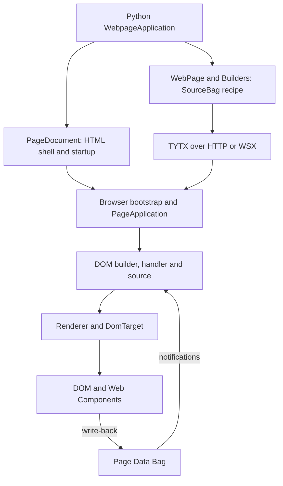
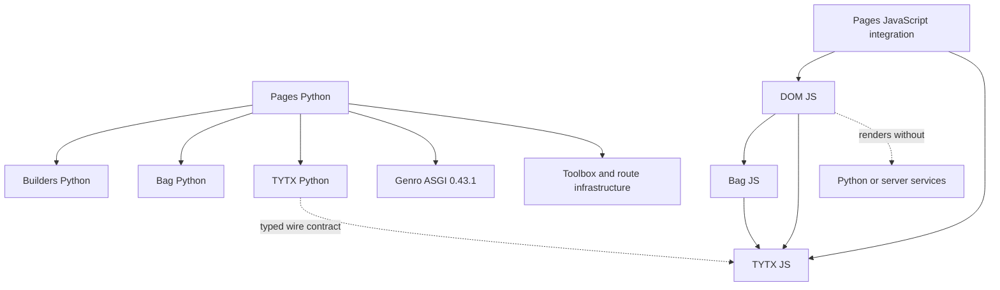

# 1. Current architecture and dependency boundaries

[Contents](README.md) · [Next: source atlas](02-source-atlas.md)

Version: 0.1 · 2026-09-08 · 🔴 DA REVISIONARE.

> **Snapshot boundary:** Chapters 1–4 describe the client assembly C tested during this analysis. The authoritative DOM worktree changed concurrently: new form/validation code is described in [the closing addendum](07-concurrent-work.md). Claims of absence apply to the tested C runtime, not to that later unverified work.

## In this chapter

- [1.1 Observed checkouts](#11-observed-checkouts)
- [1.2 What runs where](#12-what-runs-where)
- [1.3 Dependency graph](#13-dependency-graph)
- [1.4 Runtime and host ownership](#14-runtime-and-host-ownership)
- [1.5 Project status versus proposals](#15-project-status-versus-proposals)

## 1.1 Observed checkouts

| Repository | Branch | HEAD | Relevant local state |
| --- | --- | --- | --- |
| Pages | `codex/hello-world` | `25a8f9bfb3398eca85c0127ecef8733935dbf7a5` | Inspector editor/CSS, labels, null input and slider contracts, CodeMirror integration, document/dependency updates; full list in manifest |
| DOM JS | `codex/python-js-alignment` | `eaaa0ac0a582cc8f9abada1cdddf699cd0e66bbc` | Label, HTML-attribute, null-state and recipe-default helpers; identity/reconciliation and collection changes; new tests/examples |
| Builders | `codex/sourcebag-tytx` | `c6e4684914db4f3fd72c8f53b39ca270bfb6d89e` | Modified builder exports and SourceBag; untracked `tests/test_source_tytx.py` |
| Legacy | `develop` | `919a3a572acf89b4e016b2b32fd5ec556a269533` | Untracked test/application artifacts; used only for targeted source comparison |

At the initial comparison, the observed DOM `src/` tree matched C's `genro-dom-js/src/` byte-for-byte (`diff -qr` returned no differences). The closing comparison no longer matched because another task was implementing forms. This initial equality is point-in-time: C is a copy, not a live link to D. Editing D does not refresh the running assembly. Record and compare again after any other task changes DOM.

Pages has no installed `genro-pages` distribution metadata in this environment; Python imports its `src/` through `PYTHONPATH`. `pyproject.toml` declares version 0.1.0. Do not report a successful source import as proof of an installed wheel.

## 1.2 What runs where

The first response is a server-generated HTML **bootstrap document**, with import map, typed startup configuration, menu and empty page host. It is rendered by Python `PageDocument`, not by the browser page renderer. The subsequent `/main` response is a **recipe**, not page HTML. Both use Builders, but for different outputs. Distinguishing the two prevents accidentally moving reactive page rendering to the server when editing the shell.

`WebPage.main(root)` receives a Python SourceBag. A native JS builder receives a Proxy-wrapped JavaScript SourceBag in `main(root)`. After import, both paths render through the JavaScript builder/handler/renderer/target pipeline. Python methods, closures, imports and server objects do not accompany the recipe.

The present CLI uses Genro ASGI's SPA worker infrastructure. Standalone DOM `Application` requires neither ASGI nor Python. The current Python distribution declares ASGI as a required dependency; that packaging choice must not be mistaken for a fundamental requirement of a client-only GUI.

## 1.3 Dependency graph

The dotted final edge denotes independence, not a runtime import. DOM owns the rendering mechanics; Pages adds page identity and RPC. No DOM import points back to Pages. Bag and TYTX are reusable data and serialization libraries; GUI consumers must not own their general semantics.

| Dependency | Observed runtime source/version | Required for |
| --- | --- | --- |
| Python | `.venv/bin/python`, 3.12.9 | Current Pages execution; metadata allows >=3.11 |
| Builders | Metadata 0.23.2, actual B source override | Python recipes and HTML shell; local SourceBag changes matter |
| Bag Python | 0.21.1, P `.venv/lib/python3.12/site-packages/genro_bag` | Ordered typed trees |
| TYTX Python | 0.15.0, same site-packages | Typed recipe and startup encoding; MessagePack extra declared |
| Genro ASGI | 0.43.1, same site-packages | Existing HTTP/WSX host, worker registry, cookie identity |
| Bag JS | Git artifact v0.4.0, `faf6bef3badb389d25ea4cb3b35c5369cb7ffd8a` | Browser trees/notifications |
| TYTX JS | Git artifact v0.15.0, `6b9bf3a486014d92812caa3b06674083e646c5cd` | Browser decode/encode and class registration |
| DOM JS | C copy matching dirty D; package version 0.1.0 | Builders, reactivity, DOM, collections |
| jsdom | 27.0.1 in C | Node test DOM, not a browser runtime requirement |
| Node | v23.11.0 observed | Tests and developer tooling, not page viewing |
| CodeMirror/highlight.js | Versioned CDN ESM/CSS referenced by Pages | Optional laboratory editing/highlighting, not fundamental Bag reactivity |

Installed Bag/TYTX JS reside in C's `node_modules`; C exposes `genro-bag-js` and `genro-tytx` through links. A MessagePack link makes `genro-tytx/js/node_modules/@msgpack/msgpack/dist.esm` visible to the current asset host. Raw browser import maps also map `#uuid` to Bag's `browser-uuid.js`; Node handles the conditional package import through its resolver. Forgetting this difference causes browser-only import failures.

Do not upgrade Bag Python beyond the declared `<0.22` bound independently: the observed host line imports `DataChangeCollector`, whose removal is documented in the consolidation audit. This manual records the installed combination; it does not assert that no newer compatible release exists today or authorize upgrades.

## 1.4 Runtime and host ownership

A DOM `Application` owns its `BuilderHandler`, one mount target, delegated input/command listeners and topic service. The handler owns a rooted Bag containing `_` for shared data and one segment per builder name. In the usual page, `main` is that segment. `app.data` exposes the root; `app.builder.data` exposes its segment. The latter is a real branch of the former, not a copied secondary datastore.

A Pages `PageApplication` adds `pageId` and `rpc`. `DeveloperTools` is attached on demand as `app.dev`; the inspector and playground have their own child Applications and explicit disposers. Their separate data contexts prevent laboratory control values from colliding with the experiment.

The server application's registry maps page names to recipe classes. A worker-backed document request creates a registered page identity under a connection. A subsequent recipe request constructs a **fresh page-class instance and builder**. Do not assume that `WebPage` itself is a long-lived resident object preserving instance fields between RPCs. Worker registration and recipe object lifetime are separate mechanisms in this slice.

## 1.5 Project status versus proposals

There is no active unfinished `plan.md` at `.phased/` root in the observed tree. Completed slices are archived under `done/runtime-contract`, `done/page-owned-runtime`, `done/python-page-bootstrap` and `done/registered-page-startup`. `.phased/roadmap.md` retains outstanding work: broader lifecycle, resources, selective loading, production bundling, nested pages, recipe compatibility, authentication/forms, data integration and mobile verification. A completed registered-startup slice does not complete these larger areas.

The roadmap already records an approved **distribution boundary**: Pages owns Python/server and browser integration, DOM stays Python/ASGI-independent, the wheel should eventually contain compatible client artifacts. Complete dependency bundling and clean-wheel launch remain unverified future work. Part II's unification would change repository organization and requires a new decision; no rename is implied by that existing boundary.

The label/form review in P `temp/labeled-box-validation-form-review-20260908.md` is a proposal. Current code has shared internal widget labels, input null handling, limited native validity and typed inspector editing. It does not contain the proposed general `labledBox` wrapper API, shared `validate_*` engine or portable form controller. Those distinctions recur in Chapters 3–6 because they affect maintenance choices.
