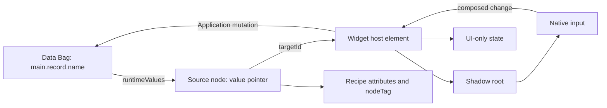
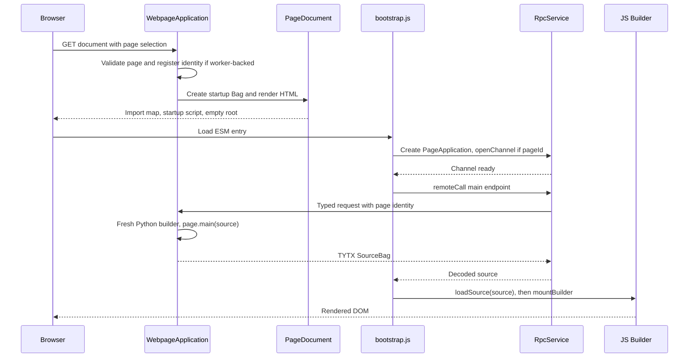
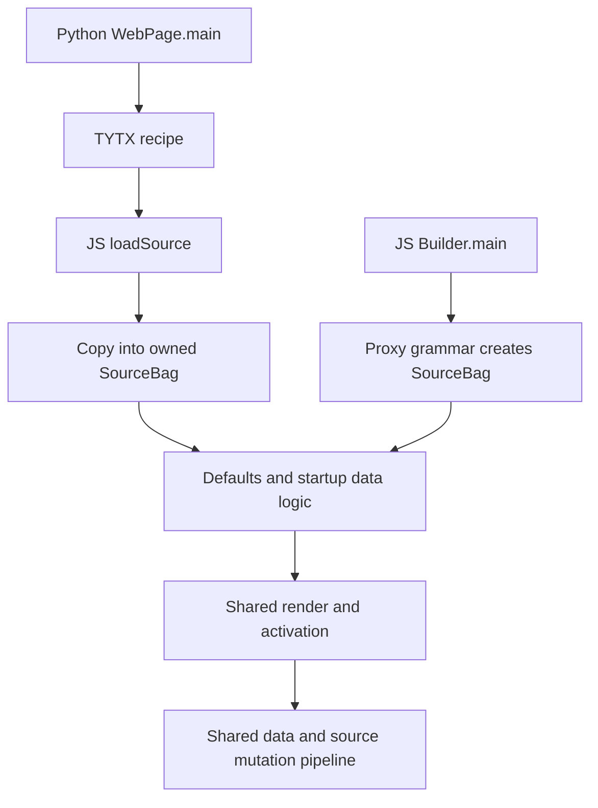
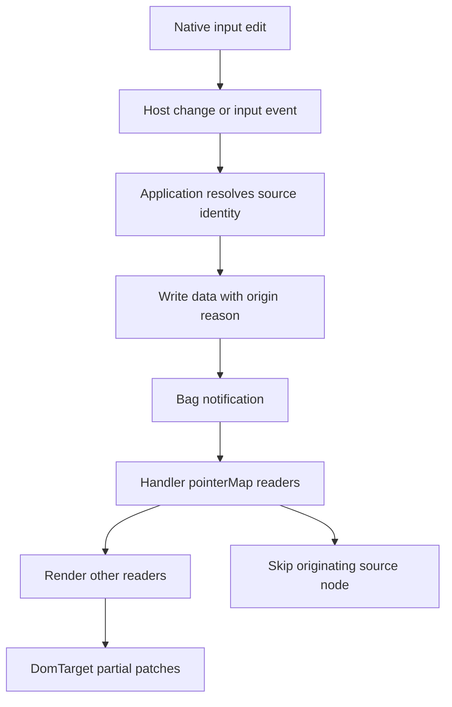
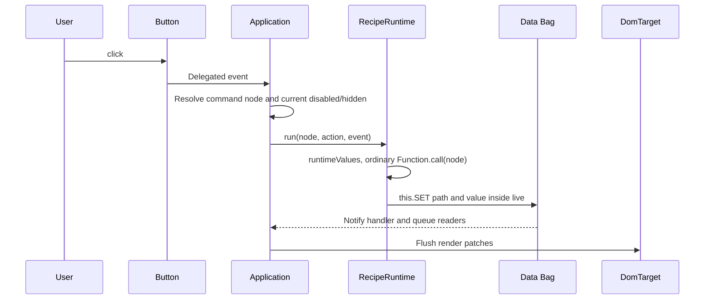
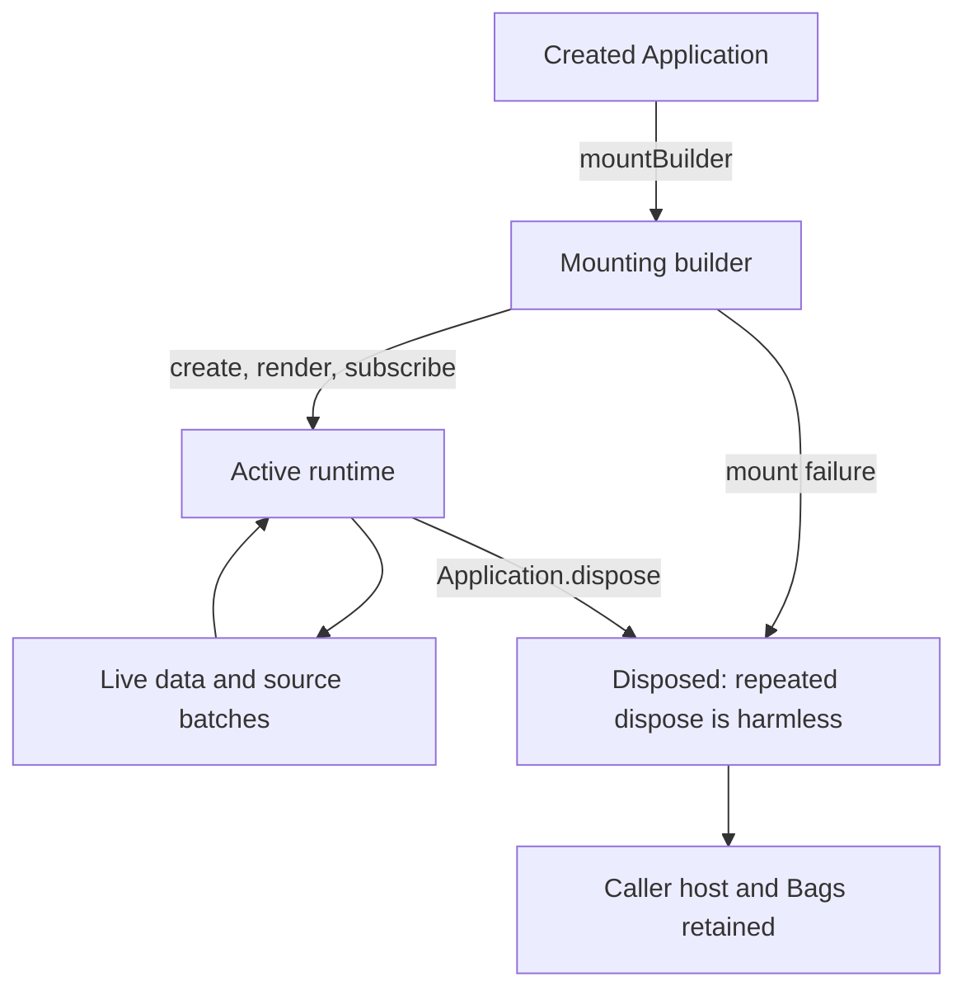
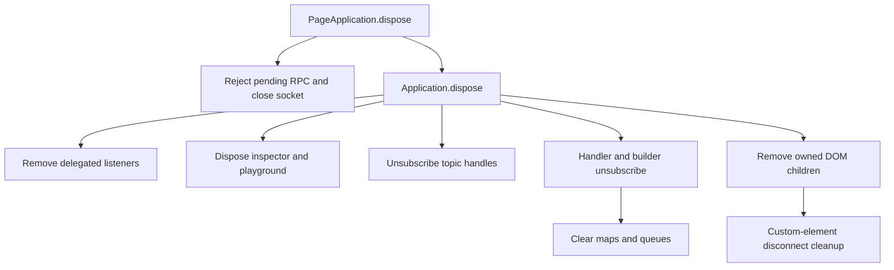

# 3. Data model, runtime APIs and complete execution paths

[Contents](README.md) · [Previous: atlas](02-source-atlas.md) · [Next: maintenance](04-maintenance.md)

Version: 0.1 · 2026-09-08 · 🔴 DA REVISIONARE.

> **Snapshot boundary:** Chapters 1–4 describe the client assembly C tested during this analysis. The authoritative DOM worktree changed concurrently: new form/validation code is described in [the closing addendum](07-concurrent-work.md). Claims of absence apply to the tested C runtime, not to that later unverified work.

## In this chapter

- [3.1 Four object models, four kinds of identity](#31-four-object-models-four-kinds-of-identity)
- [3.2 Paths and bindings](#32-paths-and-bindings)
- [3.3 Notifications and mutation discipline](#33-notifications-and-mutation-discipline)
- [3.4 Actual `genro` surface and legacy compatibility](#34-actual-genro-surface-and-legacy-compatibility)
- [3.5 Bootstrap and Python-to-browser path](#35-bootstrap-and-python-to-browser-path)
- [3.6 Native JavaScript path and convergence](#36-native-javascript-path-and-convergence)
- [3.7 Field edit → Bag → other readers](#37-field-edit--bag--other-readers)
- [3.8 Programmatic Data → widget](#38-programmatic-data--widget)
- [3.9 Source attribute → rendering](#39-source-attribute--rendering)
- [3.10 Button → callback → page update](#310-button--callback--page-update)
- [3.11 Source insertion/removal and resource lifetime](#311-source-insertionremoval-and-resource-lifetime)
- [3.12 Components and asset loading](#312-components-and-asset-loading)
- [3.13 Communication with the current host](#313-communication-with-the-current-host)

## 3.1 Four object models, four kinds of identity

A **Bag** is an ordered collection of labelled nodes. A node has a value, attributes and optional structural/type metadata; a value can itself be a Bag. `getItem` reads a value, `getNode` returns the node, and `getAttr` reads its metadata. A null value is not an absent node. Empty string, zero and false are not null. That distinction is fundamental to defaults, input editing and typed transport.

A **SourceBag** is a specialized Bag whose nodes understand builder grammar, bindings and runtime ownership. A nested SourceBag is source structure. An ordinary Bag stored in a source value or attribute can be application data and must remain ordinary data. Blindly converting every nested Bag to SourceBag destroys this distinction.

A **widget** is a JavaScript custom-element instance created for a source node. It can own UI-only state such as expanded tree paths, active dropdown, slider control or palette position. Its shadow DOM contains native controls and label structure. A **DOM node** is the renderer's output, and may be replaced without replacing its logical source node.



The arrow Data → Source means evaluation, not ownership. Data does not become a child of the source node merely because that node binds to it. The widget host belongs to the DOM target; the source belongs to the builder; the data belongs to the handler root.

There are several identities:

| Identity | Meaning | Stability |
| --- | --- | --- |
| Bag label/path | Address within a particular tree | Depends on structure and parent ownership |
| `node_id` | Author-specified source lookup anchor, used by `nodeById` and symbolic paths | Recipe-level identity; not HTML `id` |
| `_targetId`, such as `n1` | Runtime source-to-render bridge assigned by `BuilderBase.targetId` | Retained on that source node; generated after hydration |
| DOM `id` | Author HTML identity or generated fallback | May change independently of target ID |
| `data-gnr-target-id` | Explicit DOM attribute carrying runtime identity | Used by patch lookup and writeback |
| Object identity | Actual SourceBagNode or widget object | Changes on recreation; retained only where reconciliation succeeds |

`DomTarget._byId` prefers `data-gnr-target-id`, then the fallback HTML ID, scoped to its own host. Two Applications can use the same generated serials because their targets are different. Expansion components add derived row/cell addressing and `_writebackMap`; do not decode those strings in application code.

## 3.2 Paths and bindings

For a builder named `main`, the handler's root is conceptually `{_: Bag, main: Bag}`. `builder.data.setItem('record.name', 'Ada')` and `app.data.setItem('main.record.name', 'Ada')` address the same node. A source node resolves paths through `absDatapath` before reading the handler root.

| Recipe pointer / path | Resolution in a node under `datapath='record'` |
| --- | --- |
| `^.name` | Reactive read of `main.record.name` |
| `=.name` | Passive read of the same value, without registering a reactive reader |
| `^name` | Reactive read of `main.name`; ignores the container's relative base |
| `^record.name` | `main.record.name` |
| `^other:record.name` | Explicit volume: `other.record.name` |
| `^record.name?caption` | Data-node attribute read at `main.record.name?caption` |
| `.child.#parent.name` | Relative composition followed by parent-segment cancellation |
| `#FORM.name` | Resolve nearest `formId`/`form=true` anchor, then its datapath |
| `#ANCHOR.name` | Resolve nearest node carrying `_anchor` |
| `#section.name` | Find source `node_id='section'`, then resolve its relative path |

The root default is **builder-relative**, not automatically a globally shared path. The `_` segment exists for shared data across builders in one handler; it is not server-synchronized data or a cross-window global.

Relative resolution climbs the node and ancestors while the path still starts with `.`. Absolute `datapath` terminates the relative chain; relative ancestor datapaths compose. Missing anchors or excess `#parent` cancellation throw. `#FORM` is implemented as a path anchor, not evidence of a form service. See D `tests/abs-datapath.test.js` for exact cases, including explicit volumes and failure branches.

`runtimeValues(node)` evaluates both `^` and `=` at render/action time. Only `^` registers a reader in `handler.pointerMap`. A passive parameter therefore sees the latest value when a button is clicked, but does not itself trigger a rerender when data changes. Both pointer forms can produce writeback hooks on writable attributes in the current renderer; “passive” describes subscription, not guaranteed read-only behavior.

Strings beginning with binding markers are interpreted as pointers. Literal source-code displays must avoid accidentally routing isolated `^` or `=` tokens through recipe interpretation. Pages highlighter/editor integrations keep displayed code as literal text.

## 3.3 Notifications and mutation discipline

Use Bag APIs and `app.live(() => ...)` for page changes. `live` is a **synchronous batching boundary**, not an asynchronous transaction and not a rollback mechanism. Nested calls share the outer flush; nested calls may not choose a new target. The callback's effects already applied to Bags remain if it throws. The `finally` path drains formulas and clears queue state.

`Bag.setItem` supports attributes, insertion position, update/replace attribute policy, null-attribute removal, origin reason and fired semantics. The runtime's positional call is deliberately explicit; avoid copying its long positional signature casually into recipes. Source helpers are easier to read:

```javascript
app.live(() => {
    const node = app.builder.nodeById('editor');
    node.SET('.name', 'Ada');
    const current = node.GET('.name');
    node.PUT('.scratch', current);  // silent write
    node.FIRE('.changed');         // notify, then reset
});
```

This illustrates existing method APIs. `SET .name = 'Ada'` as text is different syntax and is not compiled by the new `RecipeRuntime`.

Bag backrefs let nested changes propagate to root subscribers with event metadata including node, event kind and path list. `BuilderHandler.activate` subscribes after initial render. `_onDataEvent` reconstructs the changed path, finds matching readers (exact, ancestor or descendant relationship), runs row/page data logic, and queues view patches. Source changes use a separate root subscription through `BuilderBase._onSourceEvent`.

`PUT` uses a false reason for silent mutation. `FIRE` passes the fired flag, causing event delivery followed by null reset in the Bag implementation. Consumers must read the delivered event value at notification time; a later ordinary read can already be null. Neither operation is a server push by itself.

Data formulas queue and deduplicate within a live batch; controllers run synchronously. `_drainFormulas` limits repeated execution to 50 per key per flush and reports livelock. Formula execution is not simply another DOM rendering pass. Inspect controller writes when a rendering symptom is actually a data cascade.

## 3.4 Actual `genro` surface and legacy compatibility

The current bootstrap assigns the main `PageApplication` to `window.genro` and its builder to `window.page`. Standalone DOM creates no necessary global; callers can keep the returned Application locally.

| Surface | Current behavior | Compatibility boundary |
| --- | --- | --- |
| `data`, `builder`, `root`, `handler`, `target` | Expose data root, mounted builder, grammar Proxy, coordinator and target | New explicit ownership surface, not all legacy `genro.src` methods |
| `mountBuilder(builder)` | One deferred mount; rejects second mount or disposed runtime | Used after source fetch and hydration |
| `live(fn)`, `render()`, `mutate(id,value)` | Batch changes, full render, identity-based input mutation | Synchronous callback scope; no transaction rollback |
| `publish(topic,payload)`, `subscribe(topic,callback,{signal})` | Synchronous page-local topics; subscribe returns an unsubscribe function | No full node-prefixed legacy publish/subscribe implementation |
| `events` | `TopicService` instance | Internal service vocabulary; not a legacy global bus |
| `dev` | Added when tools mount; owns inspector/playground | Optional, not a complete legacy dev service |
| `rpc` | Pages-only `RpcService`; Promise-based WSK/GET/POST | Standalone DOM has no RPC; correlation is not dataProvider support |
| `pageId` | Pages-only server identity | Absent/null for unregistered path |
| `dispose()` | Idempotent page cleanup | No full server page-close/freeze/resume lifecycle |
| Source `GET/SET/PUT/FIRE`, relative-data helpers | Methods with source path resolution | Partial legacy compatibility; signatures differ |
| Source action `this` | Real source node through ordinary function `.call(node, ...)` | Does not mean every widget/internal callback has source scope |
| `src`, `dom`, `wdg`, `dlg`, `vld`, `wsk`, `frm` legacy services | No corresponding complete service surface in current Application | Do not invent facades or call legacy-only APIs |
| `dojo.connect`, `FIRE_AFTER`, string `PUBLISH` macros, full provider language | Not implemented as general compatibility APIs | Future work |

`RecipeRuntime.run` obtains fresh runtime attributes, merges event extras, injects `genro` and `sourceNode`, filters parameter names and creates an ordinary `Function`. It calls that function with the source node as `this`, inside `app.live`. This supports action strings such as `this.SET('.result', message)`. It does not tokenize or expand legacy statements, and it is not an evaluator safe for untrusted text. Native arrow functions retain lexical `this`; rebinding cannot change that.

Data-element functions follow **another convention**. `_resolveLogicFunc` accepts a callable, a bare identifier resolved on data-logic source classes, or a non-identifier code string handled by `compileFunc`. A formula receives a bindings object and returns its result. A controller receives `(node, bindings)`. Neither is automatically the source-scoped action function. This distinction is important when a ported callback reads `this` unexpectedly.

Legacy comparison was checked in L `gnrlang.js` (`macroExpand_GET/SET/PUT/FIRE/FIRE_AFTER`), `gnrdomsource.js` (`getRelativeData`, `setRelativeData`, `currentAttributes`, `buildLblWrapper`), `genro.js` (`genroInit`) and `gnrbag.js` (`fireItem`). The old macro expansion and broad runtime services explain desired semantics, but those implementations are not loaded by the new runtime.

## 3.5 Bootstrap and Python-to-browser path



1. `P/application.py:index` validates transport and page selection, builds startup with endpoints/host IDs/client descriptors and optionally registers `page_id` through the worker.
2. `PageDocument` renders HTML. `get_script_json` escapes `<`, `>` and `&` for raw script embedding without changing decoded startup values. That boundary is distinct from TYTX escaping.
3. `bootstrap.js` decodes startup and begins a generation. It disposes the prior global app, clones/replaces the root, creates `PageApplication`, then waits for `rpc.openChannel()` whenever a page ID exists. This channel opening currently happens even if the configured default RPC method is GET or POST.
4. `RpcService.remoteCall` requests `/main`. Unregistered pages explicitly use GET. The host selects a source builder (page override or Python HtmlBuilder), invokes `main`, and serializes the source with `to_tytx`.
5. JS imports the selected builder module, calls `loadSource`, then mounts. `loadSource` must precede mounting. `create` resolves collections/components, copies the imported source into owned nodes, initializes defaults and executes startup data elements. The handler renders then activates data observation.
6. Bootstrap fetches and mounts the inspector, optionally invokes `client_setup`, starts highlighting and fills the diagnostic XML source view. The inspector is fetched in this bootstrap path even when the source-inspection panel is hidden; hiding inspection is not a network/service capability switch.

Errors include 400 for unsupported transport, 404 for unknown page, 403 for identity mismatch, import/codec errors, unknown source tags, unsupported imported resolvers and mount failures. `renderPage` disposes on current-generation failure and reports a visible load error. Generation checks suppress stale asynchronous results. They are bootstrap guards, not a universal cancellation mechanism for every application callback.

Evidence: P `test_hello_world.py` performs actual Python → ASGI response → Node decode → jsdom render for JSON and MessagePack; `test_typed_envelope.py` checks typed source/data and binary round trips; `test_page_bootstrap.py` checks document/startup; `test_registered_server.py` launches the real worker and socket path.

## 3.6 Native JavaScript path and convergence



A native builder extends `HtmlBuilder` or `GalleryBuilder`, implements `main(root)`, and is passed to `new Application(host, builder)`. `BuilderHandler.addBuilder` establishes its data segment and handler ownership before `create`. `setup(data)` can seed data and declare collections, then grammar is resolved, then `main` authors nodes. Collection modules must already have been imported.

The actual laboratory example is `P/js/src/lab-session.js:INITIAL_CODE`:

```javascript
data.setItem('demo.title', 'Hello Genro');
const pane = root.div({datapath: 'demo'});
pane.h2('^.title');
pane.textBox({value: '^.title', lbl: 'Title'});
```

Here `data` is `builder.data`, not `app.data`. The laboratory mounts an empty GalleryBuilder and executes this snippet within `app.live`. An ordinary JS page would put equivalent recipe statements in its `main` method and initial data in `setup` or a supported data declaration.

The paths converge at owned SourceBag, `runtimeValues`, renderers and handler events. Differences remain: Python syntax/grammar, type codecs, class registration and imported-source validation; JS can refer to local functions/components unavailable across the wire. Import copies labels, tags, XML tags and attributes while reconstructing `_builder`, `_handler` and target identities. A typed ordinary Bag value stays data. Legacy plain Bag import uses a compatibility interpretation of nested branches; it is not equivalent to a fully typed `XS` recipe.

## 3.7 Field edit → Bag → other readers



The HTML renderer emits pointer hooks and `data-gnr-target-id`. Input handling listens on the application root, so shadow controls dispatch composed, bubbling events from their host. `_enableInput` resolves the source node by internal target identity, chooses `checked` or `value`, and respects `updateOn`: default blur policy listens to native `change`, while `updateOn='input'` listens continuously. Sliders also interpret `intermediateChanges`.

`_mutationWrite` derives the destination from source attributes. It does not accept an arbitrary data path from an input field. Widget accessors already return booleans/numbers/null where supported. Generic `_typedValue` is limited and is not a complete dtype decoder.

`_applyMutation` writes inside `live` with the source node as `reason`. `_onDataEvent` skips that same node when queuing view updates. This anti-echo avoids replacing the editor that just wrote. Other bound nodes still update. `DomTarget._recordValue` advances its remembered recipe state after the skipped origin render.

For example, editing the title in Hello World updates `main.title` and the `^title` display. Editing a labelled textBox in the laboratory writes `main.demo.title`. The field and heading may share one data value but remain two source nodes. Evidence: D `writeback.test.js`, P `test_widget_pages.py`, `test_input_null.py` and `test_data_recipe.py`.

## 3.8 Programmatic Data → widget

```javascript
app.live(() => app.builder.data.setItem('demo.title', 'Updated'));
// Equivalent root address:
app.live(() => app.data.setItem('main.demo.title', 'Updated'));
```

This triggers the same handler path without a widget-origin reason, so the input itself is eligible for update. Do not skip it as if every write were a self-echo. `renderNodes` produces replacements or finer expansion patches; `DomTarget.partial` reconciles where its contract allows, otherwise replaces. External changes can therefore legitimately replace a focused leaf; complete focus preservation for arbitrary updates is not guaranteed.

A storeTree is an exception in ownership: its store Bag is passed as a property and it subscribes directly. General data-widget readers are excluded from normal pointer registration, while label/box decorations remain registered. This preserves internal expansion state across store notifications but means replacing a store branch needs separate attention; do not assume scalar binding machinery automatically handles every data-widget lifecycle.

## 3.9 Source attribute → rendering

```javascript
const node = app.builder.nodeById('title_echo');
app.live(() => node.setAttr({font_size: '20px'}));
```

The source root observes the attribute event. `_onUpdAttrs` unregisters old reactive pointers carried by changed attributes; `_onSourceEvent` queues a source update. Rendering reevaluates attributes, adapts CSS and creates prospective output. The target patches matching containers/decoration changes or replaces other nodes.

Changing `node.attr` directly bypasses notification. Deleting an attribute requires an API that emits its removal; the inspector uses `setAttr(attrs, true, false, false)` for a notifying replacement of the complete attribute dictionary. Its comment explicitly notes `delAttr` does not emit the required event in this path. Use the installed Bag signature, not an old package's positional assumptions.

Path-affecting source changes deserve focused tests: they can invalidate descendants' pointer registrations as well as the changed node. Inspect `_onUpdAttrs`, `_updatePointerMap` and structural tests before claiming a full inherited-datapath rebinding contract. In particular the current map registers absolute read paths while unregister code also handles attribute-qualified keys; exhaustive attribute-pointer rebinding is an audit item, not guaranteed by a broad green suite.

## 3.10 Button → callback → page update



Only buttons carrying `data-command-node` enter this route. Runtime attributes are read again at click time, so passive action parameters are fresh and disabled/hidden guards are effective. If both `action` and `publish` exist, action wins; publish is the `else` path. This is tested in D `actions.test.js` and differs from claiming full legacy action/fire/publish ordering.

A `publish`-only button emits payload `true`. `TopicService.publish` calls registered callbacks, then finds live source nodes with `subscribe_<topic>` and executes those strings with `payload` and `_kwargs`. There is no automatic node prefix. A removed source node is absent on later traversals, but this does not establish universal node-owned cancellation for arbitrary timers/Promises. Exceptions from action code are not wrapped in the bootstrap error UI; callers adding custom commands must own their error reporting.

## 3.11 Source insertion/removal and resource lifetime



```javascript
app.live(() => {
    app.builder.nodeById('list').li('New row');
});
const child = app.builder.source.getNode('body_0.ul_0.li_0');
app.live(() => child.parentBag.popNode(child.label));
```

This corresponds to the list shape in D `structural.test.js`; use the actual source path for another page. Insertion creates a node, applies one-time defaults and queues an insert with parent and before-anchor. Deletion unregisters subtree pointers, captures the target ID before attachment information disappears, and queues a remove. The optimizer nets an insert/delete in one batch, covers descendant updates when an ancestor is already replaced, and coalesces dense row/cell updates. The structural suite compares patched DOM with a fresh render.

DOM removal triggers Web Component `disconnectedCallback`, which is responsible for widget-local observers, subscriptions, timers and async generation guards. This ownership is imperfect in the current storeTree: the reproduced missing unsubscribe-options defect in Chapter 4 leaves a Bag callback active after disposal. Whole-page disposal first marks the target disposed, removes delegated listeners, disposes tools/topics/handler, and removes runtime-owned children while retaining the caller's host and the Bag data. Handler disposal clears root subscriptions, builder subscriptions, pointer maps, pending formulas and component rule registries. Pages disposes RPC first.



This is page-owned cleanup, not a complete source-node lifecycle service. There is no generic hook that automatically cancels every user-created async task when a subtree is removed. Each collection/tool must release its external resources explicitly. See P runtime disposal tests for idempotence, retained Bags, child tools and failed mount; D collection tests for disconnect behavior.

## 3.12 Components and asset loading

A collection ESM import calls `registerCollection(name, spec)`. `wc_requires` or `wcRequires(...)` selects names; `create` merges grammar, calls idempotent `defineComponents` and optionally injects CSS. Requiring an unknown name throws. This is registry resolution, **not** a network loader: current GalleryBuilder imports all its collections eagerly.

Builder components are different from Web Components. `static components` registers render-time recipe expansion methods; `static containers` exposes author-time composition methods. `RendererBase._renderComponent` expands parameters, a single `store` record or each `iterate` row into a temporary source tree, requiring a single tree root per block. It records writeback and row/cell coordinates so later mutations can target expansions. Component rule templates execute against a `RowContext` for the current row; retaining a registration row's source node would resolve the wrong data.

The static source recipe holds a component invocation; its expansion nodes can be ephemeral. This is why a simple one-source-node/one-visible-element model does not describe every rendered row. D `component`, `container`, `component-rules` and `per-row-patches` tests cover this area. Lazy iteration and a complete source-subtree resource loader are not established.

Asset delivery is P `WebpageApplication.__call__` under `/_assets/<root>/...`, allowing JS/MJS/CSS files within resolved approved roots and GET/HEAD only. Python source and arbitrary filesystem files are not served through that branch. CodeMirror imports pinned CDN modules asynchronously, retains a textarea on failure and guards late completion by generation/isConnected. Highlighter loading is optional. No production hashed manifest or complete page `js_requires/css_requires/py_requires` system is implemented.

## 3.13 Communication with the current host

`RpcService` supports WSK and explicit GET/POST. WSK opens `/_wsx`, performs `/_wsx/openchannel` for the registered page, then sends `WSX://` plus JSON metadata containing correlation `id`, method, path, `page_id` and a TYTX-encoded `data` field. Responses decode through TYTX, settle the matching promise once, and reject non-2xx status. Unsolicited IDs and expired replies are ignored; malformed outer protocol disposes the service. Timeouts remove pending calls; no reconnect/replay is implemented.

HTTP GET encodes each query value with TYTX; POST sends TYTX JSON with the corresponding media type. HTTP result decoding uses the requested JSON/MessagePack mode. WSK's outer envelope remains text/JSON and its decoded result is typed; selecting MessagePack for a recipe does not mean the browser connection switched to raw binary WebSocket frames.

Correlation protects call identity, not application-level “newest edit wins.” If application code starts two calls and writes each resolved result to one field, it still needs a generation/version policy. Disposal aborts HTTP work and rejects pending socket requests, but it does not roll back an already executed remote action.

Server `get_registered_page` checks channel/page-ID consistency, cookie connection, page ownership and request identity. P `test_registered_server.py` proves two pages under one cookie, channel opening, both recipe transports, GET/POST access and foreign-connection rejection. The generic browser root/nested-iframe transport bridge, server close notification, freeze/resume and a login lifecycle remain future work. DOM's `gnr-set` is an in-page widget command and is not a server authorization boundary.
