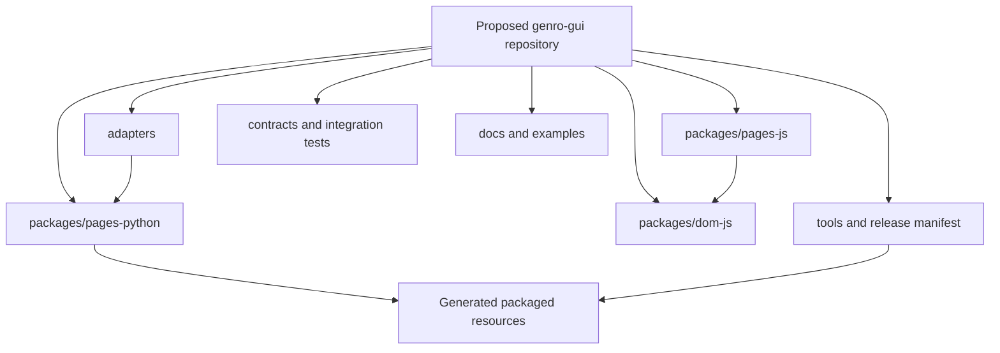
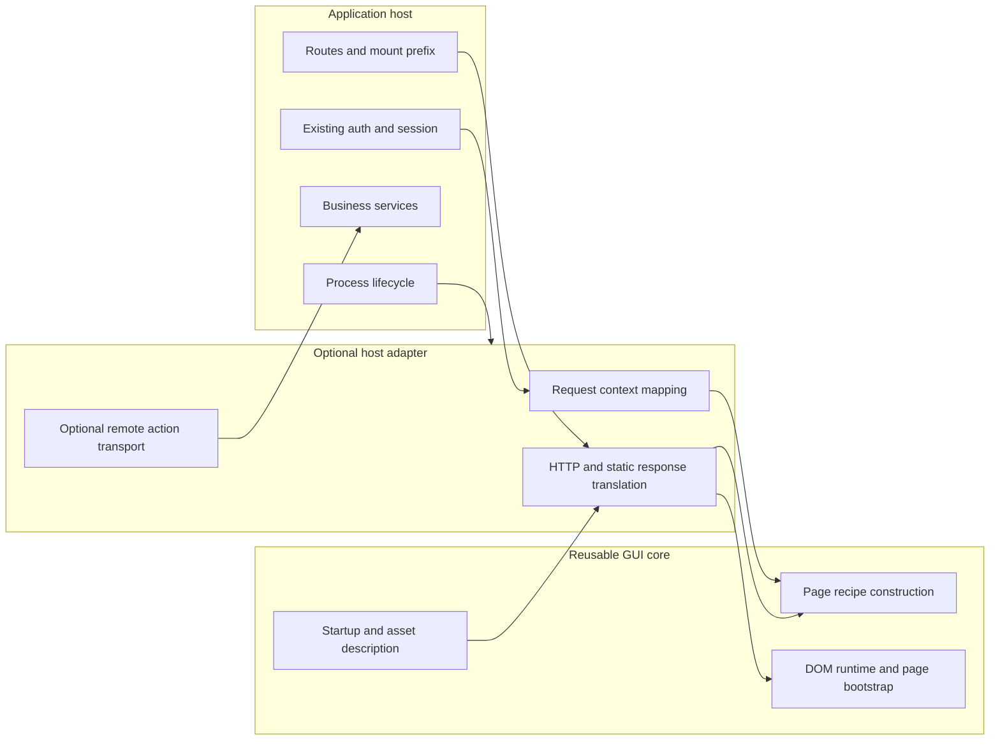
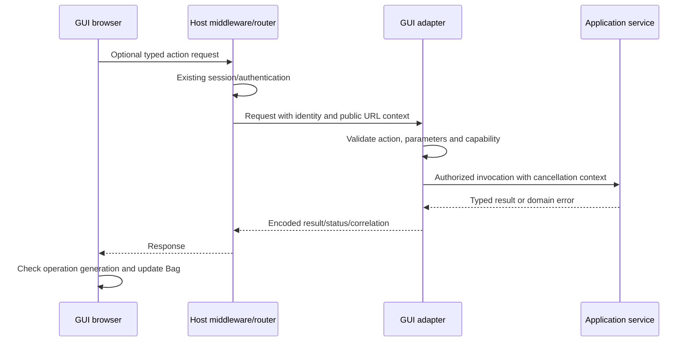
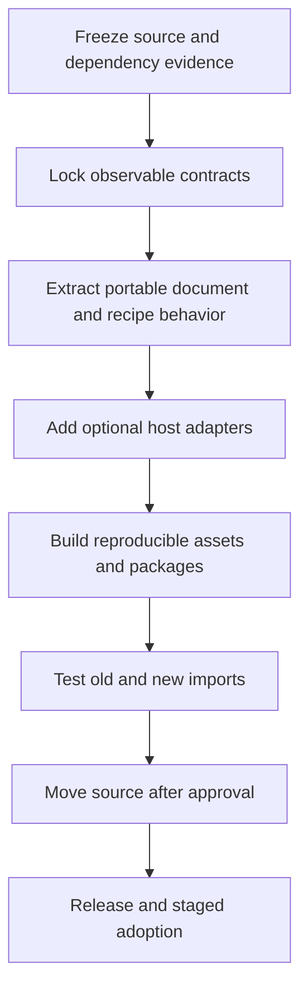

# 5. Proposed unified repository, host adapters and migration

[Contents](README.md) · [Previous: maintenance](04-maintenance.md) · [Next: reference](06-reference.md)

Version: 0.1 · 2026-09-08 · 🔴 DA REVISIONARE.

**Everything in this chapter describing new packages, directories, manifests or adapter APIs is proposed.** `genro-gui` is a provisional repository name. No repository rename, source relocation, migration or new public symbol is approved by this manual. Existing package/import identities should survive until the owner explicitly decides otherwise.

## In this chapter

- [5.1 Recommendation and alternatives](#51-recommendation-and-alternatives)
- [5.2 Proposed directory tree](#52-proposed-directory-tree)
- [5.3 Dependencies that remain autonomous](#53-dependencies-that-remain-autonomous)
- [5.4 Versioning, contracts and artifact selection](#54-versioning-contracts-and-artifact-selection)
- [5.5 Core / adapter / host contract](#55-core--adapter--host-contract)
- [5.6 Is common ASGI sufficient?](#56-is-common-asgi-sufficient)
- [5.7 Prefixes, URLs and bootstrap configuration](#57-prefixes-urls-and-bootstrap-configuration)
- [5.8 FastAPI minimum example — proposed API, not executable today](#58-fastapi-minimum-example--proposed-api-not-executable-today)
- [5.9 Starlette example — prefix mount with host service and lifecycle](#59-starlette-example--prefix-mount-with-host-service-and-lifecycle)
- [5.10 Remote request sequence, errors and session ownership](#510-remote-request-sequence-errors-and-session-ownership)
- [5.11 Incremental migration, if approved](#511-incremental-migration-if-approved)

## 5.1 Recommendation and alternatives

Recommend one development repository containing clearly separated Python GUI authoring, JavaScript DOM runtime, browser page integration and optional host adapters, while retaining independently consumable distributions. Co-location makes cross-language contract changes reviewable together; it must not turn DOM into a Python client or turn every GUI page into a Genro ASGI application.

| Alternative | Advantage | Cost / risk |
| --- | --- | --- |
| Keep separate repositories; strengthen compatibility manifest and CI | Least disruption; preserves independent release ownership | Atomic Python/JS changes and local override discovery remain harder |
| One repository, one mandatory Python+server package | Simplest apparent release number | Forces framework dependencies on client-only users; weakens standalone DOM and optional hosting |
| **One repository, several packages with a coordinated compatibility manifest** | Cross-language review in one change; standalone JS and optional hosts remain possible | Needs release tooling, package-boundary checks and manifest discipline |
| One repository with fully independent versions and no release set | Maximum release freedom | Recreates mismatch/discovery problems unless compatibility tests are unusually strong |

The third option balances the current development pattern and independent runtime boundary. A unified source repository is not a reason to merge Bag or TYTX into GUI. If unification is declined, the same manifest, isolated installation tests and adapter contracts still improve the current repositories.

## 5.2 Proposed directory tree

```text
genro-gui/                              # provisional source repository name
  pyproject.toml                        # Python build/test coordination
  package.json                          # developer workspace/build commands
  packages/
    pages-python/
      pyproject.toml                    # initially preserves genro-pages identity
      src/genro_pages/
        page.py                         # portable recipe-facing WebPage contract
        document/                       # shell/startup construction, no host imports
        recipes/                        # GUI grammar/composition, uses Builders
        resources/                      # generated release assets; never hand-edited
    dom-js/
      package.json                      # preserves standalone genro-dom-js exports
      src/
        application.js                  # no page identity or transport requirement
        source-bag.js
        builder-base.js
        builder-handler.js
        renderer/
        contrib/
        collections/
        services/
    pages-js/
      package.json
      src/
        bootstrap.js                    # page config and lifecycle coordination
        application.js                  # page integration over DOM Application
        transports/                     # optional host transport implementations
        devtools/                       # inspector and playground integrations
  adapters/
    asgi/                               # minimal common HTTP/static ASGI adapter
    fastapi/                            # optional router/dependency integration
    genro-asgi/                         # registry, worker, WSX and identity specifics
    wsgi/                               # only if a concrete consumer needs it
  contracts/
    startup/                            # versioned schema and compatibility rules
    recipe/                             # GUI grammar compatibility metadata
    fixtures/                           # typed Python/JS conformance payloads
    capabilities/                       # optional host service descriptions
  assets/
    styles/                             # shared authored themes
    manifest.schema.json                # release metadata contract
  tests/
    python/                             # portable authoring/document tests
    javascript/                         # page integration tests
    integration/                        # Python-to-JS and host adapter contracts
    browser/                            # focus/layout/network real-browser checks
    packaging/                          # clean wheel and standalone ESM checks
  examples/
    standalone-js/
    fastapi-client-page/
    starlette-prefix-mount/
    genro-asgi-registered/
  docs/
    manual/
    decisions/
    compatibility/
  tools/
    assets/                             # resolve, build, hash and copy release artifacts
    release/                            # version/manifest/license checks
    development/                        # explicit source overrides and import-map generation
  dist/                                 # generated distributions, not source
  temp/                                 # drafts and local evidence, ignored
```



Directory names describe responsibilities and are not final public APIs. `pages-js` is worth separating even if initially published inside the Python wheel only: bootstrap, developer tools and transport do not belong in the Python-independent DOM package. Whether it becomes a separately published JS package can wait for an actual non-Python consumer.

Shared styles should have one authored source; component-internal styles remain with their collections unless a clear resource contract makes separate CSS useful. Do not move shadow styles into a global file merely to make the tree symmetric. Generated resources in the wheel are build products copied from authored JS/style packages and locked dependency artifacts.

## 5.3 Dependencies that remain autonomous

- **Bag Python and Bag JS:** general ordered tree/notification semantics and class hydration used beyond GUI. Release fixes there, consume known artifacts here.
- **TYTX Python/JS:** serialization protocol, type registry and transport variants. GUI owns its SourceBag registration and compatibility requirements, not the generic codec.
- **Builders Python:** grammar, static rendering and general composition support for other dialects. GUI-specific grammar/composition can live in GUI; do not absorb its generic core.
- **Genro ASGI and its evolving orchestration packages:** worker lifecycle, connection/page registry, transport and server composition remain host infrastructure. GUI supplies a dedicated adapter.
- **FastAPI/Starlette and external editor/highlighter libraries:** optional integration/build dependencies, selected through extras and asset manifests rather than vendoring maintained source forks.

This avoids making a change to a generic Bag notification contract require a GUI release before other consumers can use it. The GUI release set records the versions it tested.

## 5.4 Versioning, contracts and artifact selection

Recommend a coordinated **GUI release set** with independently named Python and JS artifacts. Initially align the GUI-owned package versions where practical, while recording exact dependency revisions and a separate startup/recipe contract version. A shared number is convenient release bookkeeping; it does not replace protocol compatibility.

Proposed manifest fields: GUI release ID, Python/JS package versions, startup protocol range, GUI recipe capability/version, TYTX compatibility, selected collection modules, file hashes, content types, license records and optional host capabilities. A browser should fail clearly if the required contract is unsupported instead of half-rendering an unfamiliar recipe. Old/new fixtures should establish which additive fields can be ignored and which unknown required capabilities must fail.

Use two tests in parallel: codec conformance (types and structures survive) and semantic conformance (the receiving runtime knows the recipe tags and attributes). A decoder accepting `XS` says nothing about whether a new widget or validation rule is supported. Version the startup envelope independently enough to distinguish transport errors, grammar mismatch and missing optional services.

For releases, resolve a locked dependency graph, build the selected ESM/CSS artifacts once, produce hashed immutable URLs and a manifest, and include them in the wheel. A clean Python installation must find assets through package resources, not sibling directories or npm. A frontend-only consumer installs the DOM JS package and its declared dependencies. The current D package's file dependency and undeclared direct TYTX import need distribution review before that promise is made.

Avoid selecting a bundler by habit. Raw ESM is transparent in development; a production tool must correctly handle bare/conditional imports, `#uuid`, dynamic imports, CSS, shared dependency deduplication and source maps. The existing esbuild evaluation is relevant, but Vite/esbuild selection is not settled here. Test the output served from the wheel, not only the source build directory.

| Mode | User tools | Asset resolution |
| --- | --- | --- |
| Published Python library | Python/package installer plus chosen server; no Node/npm required | Embedded manifest and packaged compatible assets |
| Published standalone JS | Browser and chosen JS package workflow; no Python required | Package exports/bundler or documented ESM map |
| Develop Python recipes against release | Python and server | Released embedded assets unless explicitly overridden |
| Develop runtime/collections | Supported Node, test tooling and browser; Python for integration tests | Explicit source manifest/module root pointing at authored files |
| Build/release GUI | Python build backend plus locked JS build tools | Reproducible build and license/version verification |

Development overrides should be opt-in and printed at startup with resolved paths/revisions. A developer editing D while serving an old copy is a predictable failure mode; the future dev command should expose exactly which source tree is active. It should never silently replace installed artifacts with a sibling checkout.

## 5.5 Core / adapter / host contract



The minimum portable contract should describe behavior before choosing public names:

| Operation / information | GUI responsibility | Host/adapter responsibility |
| --- | --- | --- |
| Build recipe | Fresh source builder, page main, typed result | Choose allowed page, supply explicit context, schedule sync work appropriately |
| Build document | Stable host elements, typed startup serialization, resource declarations | Supply externally valid URLs, response headers/status and request-local choices |
| Find assets | Immutable asset metadata and bytes/resource handles | Serve or delegate to static/CDN route with correct content type/cache behavior |
| Startup configuration | Builder descriptor, required collections, transport-independent configuration | Concrete endpoints, mount/public base URL, optional identity/capabilities |
| Request context | Consume a small documented context if page needs it | Map framework request, locale, authenticated principal and services without serializing them |
| Remote actions, optional | Describe requests/results and client-side lifecycle | Whitelist methods, authorize, validate parameters, execute host services, encode errors |
| Page identity, optional | Use identity if supplied by a selected capability | Create/validate identity under host's session; own expiry and retention policy |
| Real-time channel, optional | Consume agreed transport adapter | Authenticate/authorize socket, route messages, manage process resources |
| Shutdown | Dispose browser resources and cancel local work | Close host-owned resources through explicit lifespan integration |

A **pure client page** needs only an HTML document, compatible assets, a recipe (embedded or fetched) and a browser Application. It needs no database, RPC endpoint, connection cookie, resident page register or WebSocket. A Python recipe can be compiled by a CLI/static export step or generated for each HTTP request. Dynamic server actions add an optional endpoint. Push/remote reactive fragments add additional capabilities; they must not become hidden prerequisites of basic rendering.

Current Pages does not yet implement this complete capability model: registered bootstrap always opens its channel and requests an inspector recipe. The adapter extraction must remove those implicit requirements through explicit bootstrap configuration, while preserving the existing registered host as a supported mode.

## 5.6 Is common ASGI sufficient?

A small ASGI application is sufficient for HTTP document, recipe and static-resource endpoints across ASGI-capable hosts. It should depend on ASGI concepts rather than on the Genro worker registry. A framework's existing router can mount it; host-specific request services can be passed through an explicit bridge.

A dedicated **FastAPI adapter** is useful when GUI endpoints must participate in dependencies, security declarations, request validation or the application's API documentation. Mounting an independent ASGI child does not automatically run FastAPI route dependencies on that child's routes. Prefer a router integration for such cases; avoid implying that ASGI mounting supplies framework-level dependency injection.

A **Genro ASGI adapter** is necessary for the existing page/connection register, WSX semantics, worker orchestration and identity scope. Those mechanisms cannot be generalized merely by renaming the class to `AsgiAdapter`. Keep their protocol behavior in focused integration tests.

A WSGI/static integration can reuse pure recipe/document/asset generation without pretending WSGI supplies a persistent WebSocket. Do not add WSGI implementation until a consumer needs it. A notebook or desktop embedded browser can likewise use generated assets and client-only recipes, with an optional message bridge defined separately.

FastAPI documents `app.mount` for independent subapplications and prefix propagation through `root_path`; static files are also a mounted application. These mechanisms support the proposal but do not fix Pages' existing root-absolute URLs. [FastAPI subapplications](https://fastapi.tiangolo.com/advanced/sub-applications/), [FastAPI static files](https://fastapi.tiangolo.com/tutorial/static-files/).

Starlette provides `Route`, `Mount`, named reverse lookups and a minimal Router ASGI application. These are sufficient host primitives for the second example below. [Starlette routing](https://starlette.dev/routing/).

## 5.7 Prefixes, URLs and bootstrap configuration

Treat the public URL base, internal ASGI route path and physical asset location as different values. A deployment can expose `/portal/gui/` while the mounted adapter internally handles `/`. The host should generate URLs from named routes or a normalized externally visible prefix and pass them to the document builder. Asset URLs, recipe URLs, action endpoints, menu links and socket URLs must use the same contract. Do not join URLs with filesystem path functions or hardcode leading `/` in collection imports.

ASGI `root_path` describes a mount/proxy prefix; forwarding headers and external scheme/host trust belong to the application/server configuration. A relative socket endpoint can be resolved against the document's public URL, then map HTTP to WS and HTTPS to WSS. Test nested mounts and reverse proxies, not just a root launch.

The current shell import map, GalleryBuilder absolute imports and `RpcService._openChannel` are concrete places requiring extraction. Prefer manifest-resolved module URLs so core modules do not know `/_assets/dom/`. Preserve raw ESM development by generating an import map from the same asset description used in release mode.

## 5.8 FastAPI minimum example — proposed API, not executable today

The FastAPI methods below are documented host APIs; **`PortableGui` and `AsgiGui` are illustrative placeholders and do not exist in the inspected repositories**. Their names/signatures require owner review. This sketch describes the desired consumer experience, not a migration already performed.

```python
# PROPOSAL / PSEUDOCODE: the genro_gui imports do not exist today.
from fastapi import FastAPI
from genro_gui import PortableGui
from genro_gui.adapters.asgi import AsgiGui
from genro_pages.page import WebPage  # existing authoring shape to preserve

class GreetingPage(WebPage):
    def main(self, root):
        root.h1("Hello")
        root.input(value="^title")
        root.div("^title")

host = FastAPI()
gui = PortableGui(pages={"hello": GreetingPage}, default_page="hello")
host.mount("/gui", AsgiGui(gui, capabilities={"remote_actions": False}))
```

Required behavior: GET `/gui/` returns prefix-correct HTML and startup without page identity/channel requirements; assets and recipe load under the same mount; input writes remain client-local. No connection register, database or RPC service is constructed. A production install reads assets from the GUI package. A test must follow the returned asset/recipe URLs, not merely assert that mounting succeeds.

For an authenticated server action, the proposed dedicated FastAPI integration should accept an explicit host dependency or context factory. The action itself remains an ordinary host service and is authorized for each request. That additional mode must not alter the minimum client-only example. Its signature is left open until the owner chooses dependency/context naming.

## 5.9 Starlette example — prefix mount with host service and lifecycle

This second sketch deliberately exercises optional server behavior. **The GUI symbols remain pseudocode**; Starlette's mounting and lifespan mechanisms are real. It is not executable against current Pages.

```python
# PROPOSAL / PSEUDOCODE: GUI classes and context bridge are not implemented.
from contextlib import asynccontextmanager
from starlette.applications import Starlette
from starlette.routing import Mount
from genro_gui import PortableGui
from genro_gui.adapters.asgi import AsgiGui

class HostServices:
    async def initialize(self):
        pass  # application-owned service startup

    async def close(self):
        pass  # application-owned service shutdown

services = HostServices()

@asynccontextmanager
async def lifespan(app):
    await services.initialize()
    try:
        yield
    finally:
        await services.close()

# build_context must map only explicit request identity/services;
# it must not manufacture a Genro connection or page registry.
def build_context(scope):
    return {"principal": scope.get("user"), "services": services}

gui = PortableGui(pages=page_registry, default_page="home")
mounted_gui = AsgiGui(
    gui,
    context_factory=build_context,
    remote_actions=allowed_action_registry,
)
app = Starlette(
    routes=[Mount("/portal/gui", app=mounted_gui, name="gui")],
    lifespan=lifespan,
)
```

`page_registry` and `allowed_action_registry` are application-supplied placeholders. The example's significance is ownership: the host creates/services/closes resources; the adapter maps context; page construction and typed results stay GUI functions. Production code would explicitly authorize actions, and an unauthenticated `principal` would not confer access merely because it exists in a dictionary.

Starlette's lifespan context brackets service readiness and shutdown. The parent application must explicitly orchestrate lifecycle for resources owned by mounted integrations; do not assume child mounting alone invokes every startup hook. FastAPI also documents lifespan handling on the main application rather than mounted subapplications. [Starlette lifespan](https://starlette.dev/lifespan/), [FastAPI lifespan](https://fastapi.tiangolo.com/advanced/events/).

## 5.10 Remote request sequence, errors and session ownership



The adapter should expose an explicit action registry, not arbitrary Python attribute dispatch. Host authentication/session middleware remains authoritative. A page may use existing session identity without creating a parallel login system. Cookie-based action requests need the host's CSRF policy; socket requests need the host's origin/auth checks. These are adapter contract responsibilities, not database prerequisites.

Separate failures into route/permission errors, malformed typed input, incompatible client contract, domain validation, unexpected host error, timeout/cancellation and unavailable optional capability. Return stable error codes and correlation information; keep internal tracebacks in host logs. Do not treat a failed optional highlighter load like a failed page recipe, and do not retry a non-idempotent action automatically after uncertain delivery.

A stateless page needs request lifetime only. A registered resident page needs an explicit registry/lifetime provider. Optional WebSockets need ownership, close/reconnect and stale-result policies. Root-only physical sockets and nested-page routing should be added only with the already identified identity/cleanup contracts; they are not consequences of ASGI itself.

## 5.11 Incremental migration, if approved



| Stage | Transfer / preserve | Gate before proceeding |
| --- | --- | --- |
| 0. Inventory | Capture dirty Pages/DOM/Builders work, actual client roots, dependency releases and existing import users | Reproducible snapshot; no lost uncommitted feature or backup |
| 1. Contract baseline | Preserve source/data typing, relative paths, node IDs, event order, input behavior and cleanup expectations | Current tests plus explicit gaps such as storeTree disconnect and rebinding |
| 2. Portable Python seam | Separate recipe/document/startup construction from routed HTTP response and worker registry | Build typed recipe/document without importing a server framework |
| 3. Browser capability seam | Separate minimum mount from inspector/RPC/channel; remove implicit host URL knowledge | Client-only page works without RPC/WS/database; registered behavior still passes |
| 4. Host adapters | Transfer routes/assets/context and Genro-specific registry/worker/WSX wiring to owning adapter | FastAPI/Starlette prefix tests plus original real worker test |
| 5. Asset pipeline | One authored source, manifest, locked dependency graph, wheel/ESM builds | Clean wheel launch without Node/siblings; standalone JS consumption; license manifest |
| 6. Source co-location | Move only after owner approves structure/name; retain history where feasible | Same behavior from new paths; no duplicated authoritative runtime copies |
| 7. Compatibility release | Preserve `genro_pages.page.WebPage`, existing exports and `genro-dom-js` public entry/collections where promised | Existing import and asset-contract fixtures; documented deprecation policy |
| 8. Consumer adoption | Replace local overrides only with verified released artifacts | Demo and integration tests on installed release; explicit rollback path |

Preserve `main(root)`, page client descriptors, recipe names and parameter meanings unless a concrete semantic change is approved. Inventory both `genro_pages.hello_world.HelloWorldPage` (legacy host) and `genro_pages.pages.hello_world.HelloWorldPage` (recipe): they are not interchangeable despite their class name. Worker entry-module strings and wheel resource paths count as compatibility surfaces alongside Python imports.

Tests added for migration should be observable contracts: same typed source after Python/JS round trip; root and prefixed startup; app isolation; no callback after disposal; node identity/focus for self-write and decoration updates; authorized/foreign identity behavior; stale async reply suppression; missing resource diagnostics; old/new manifest compatibility; clean installation without Node and sibling trees. Avoid asserting only that files moved to new directories.

Major risks are silent loss of dirty dependency work, mixing two Bag JS copies in one realm (`instanceof`/registry failures), mismatched SourceBag branch tags, lifecycle ownership split across host and core, prefix-incorrect absolute imports, package metadata promising assets it does not contain, and accidental legacy API claims. Keep fallback release artifacts available until the new package works in a clean environment.

Open decisions include repository and distribution names, public adapter/context names, release-set version policy, exact protocol negotiation, bundled collection selection, build tool, URL/cache policy, optional service discovery and the placement of Genro-specific transport. None should be settled by moving files first.
