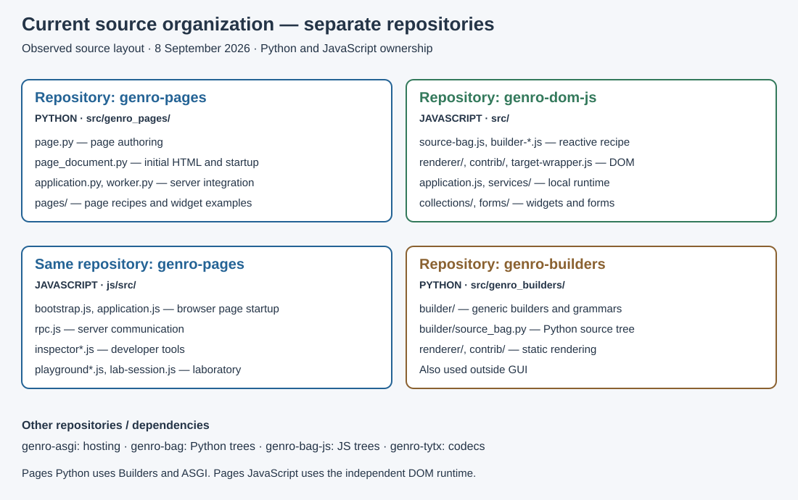
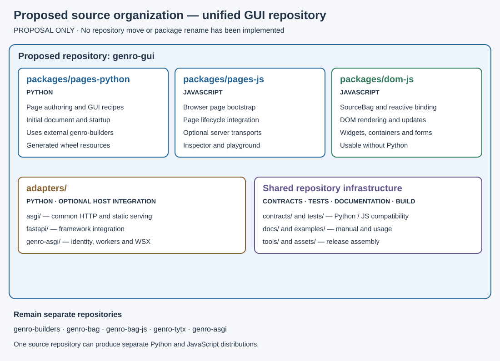

# Repository maps: current and proposed

[Contents](README.md) · [Detailed source atlas](02-source-atlas.md) · [Unified repository proposal](05-proposal.md)

Version: 0.1 · 2026-09-08 · 🔴 DA REVISIONARE.

This visual guide compares the observed source ownership with the proposed unified
GUI repository. The current map includes the later form source directories; it
is a source inventory, not an extension of the manual's tested runtime snapshot.
The unified map is a proposal only: no migration or rename has been implemented.

## Current: separate repositories



The two blue boxes belong to **the same genro-pages repository**. Python creates
the page recipe and initial document; the JavaScript integration starts the browser
page and connects it to the server. **genro-dom-js** owns the generic client runtime.
**genro-builders** owns generic Python construction and static rendering.

```text
genro-pages/
  src/genro_pages/              Python page authoring and server integration
    pages/                     Concrete recipes and widget examples
  js/src/                      JavaScript page startup, RPC and developer tools
  tests/                       Python tests and Python-to-JavaScript consumers
  js/tests/                    Focused JavaScript service tests

genro-dom-js/
  src/                         JavaScript GUI engine
    renderer/                  Recipe rendering
    contrib/html/              HTML dialect
    contrib/svg/               SVG dialect
    collections/               Widgets and containers
    forms/                     Form controller, fields and validation
    services/                  Recipe actions and topics
  tests/                       Standalone JavaScript runtime tests

genro-builders/
  src/genro_builders/           Generic Python builder library
    builder/                   Grammars, construction and SourceBag
    renderer/                  Static rendering
    contrib/                   Specialized dialects
```

Active Pages checkout: `/Users/gporcari/Sviluppo/genro_ng/meta-genro-modules/sub-projects/genro-pages`.
The development overrides used during this work locate DOM and Builders under
`/Users/gporcari/Documents/ChatGPT/genro-pages/worktrees/genro-dom-js` and
`/Users/gporcari/Documents/ChatGPT/genro-pages/worktrees/genro-builders`.
These locations are development checkouts, not a proposed package layout.
`temp/client-*` and installed `node_modules` are assemblies/dependencies; they
are not additional repositories owning the GUI source.

## Proposed: one genro-gui repository



Directory and package names are provisional. Co-location supports changes to
Python and JavaScript contracts in one review while preserving the independent
DOM runtime and optional host integration.

```text
genro-gui/                         Proposed repository
  packages/
    pages-python/                 Python page authoring, document, GUI recipes
      src/genro_pages/
    pages-js/                     JavaScript page integration
      src/
        transports/               Optional host transports
        devtools/                 Inspector and playground
    dom-js/                       Independent JavaScript GUI runtime
      src/
        renderer/
        contrib/
        collections/
        forms/
        services/
  adapters/                       Python integration with chosen hosts
    asgi/
    fastapi/
    genro-asgi/
  contracts/                      Startup and recipe compatibility
  tests/                          Python, JS, integration, browser, packaging
  assets/                         Shared authored styles and manifest schema
  tools/                          Asset builds and coordinated releases
  examples/
  docs/manual/
  dist/                           Generated distributions
```

The form directories shown here carry the responsibility now present in DOM's
source; this does not change their verification status recorded in the concurrent
work addendum. A WSGI adapter remains conditional on a concrete consumer.

## Where the existing sources would go

| Current owner / source | Proposed destination | Responsibility |
| --- | --- | --- |
| Pages `page.py`, portable document code and GUI recipes | `packages/pages-python/` | Python GUI authoring and startup description |
| Pages `bootstrap.js`, `application.js` | `packages/pages-js/src/` | Browser page startup and lifecycle |
| Pages `rpc.js` | `packages/pages-js/src/transports/` | Transport integration, separating host-specific behavior |
| Pages inspector and playground JavaScript | `packages/pages-js/src/devtools/` | Development tools |
| DOM `src/` | `packages/dom-js/src/` | Independent rendering, bindings, widgets and forms |
| Pages server application, worker and configuration | Portable parts in core; host-specific parts in `adapters/genro-asgi/` | Requires decomposition, not a blind file move |
| Generic Builders implementation | External `genro-builders` repository | Reusable construction and rendering |
| Bag Python, Bag JS, TYTX and Genro ASGI | Their existing repositories | Data structures, codecs and hosting |

## Source repositories versus distributions

The proposed repository would contain multiple maintained source packages.
A Python wheel would include generated compatible browser assets; a standalone
JavaScript DOM distribution would remain independently usable. Generated resources
must come from the authored JavaScript sources, not a second manually maintained
copy. Publishing `pages-js` separately remains an open decision.

See the [full proposal](05-proposal.md) for host contracts, packaging and migration
conditions, and the [source atlas](02-source-atlas.md) for individual files.
